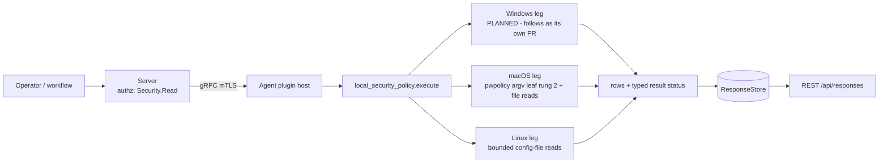

# local_security_policy

<!-- BEGIN GENERATED: plugin-doc-gen header -->
| | |
|---|---|
| **What it does** | Reports local password, lockout and audit policy posture |
| **Version** | 1.0.0 |
| **Kind** | Collector · read-only · gathered (crossplatform.local_security_policy.password_policy, crossplatform.local_security_policy.lockout_policy, crossplatform.local_security_policy.audit_policy) |
| **Platforms** | Windows 🟡 planned · macOS 🟡 constrained · Linux 🟡 constrained |
| **Actions** | `audit_policy` (definition `crossplatform.local_security_policy.audit_policy`) · `lockout_policy` (definition `crossplatform.local_security_policy.lockout_policy`) · `password_policy` (definition `crossplatform.local_security_policy.password_policy`) |
| **Security** | securable `Security` · operation Read · risk Low · dispatch ReadOnly · approval gate None |
| **Roles** | execute: endpoint-admin, endpoint-operator, security-admin · author: content-author |
<!-- END GENERATED -->

## How it works

Three read-only actions (`local_security_policy_plugin.cpp`) report a host's local security policy: `password_policy`, `lockout_policy` and `audit_policy`. Each writes pipe-delimited rows, the first field being the action name, then `<key>|<value>|<source>`. No action takes parameters, so no request text reaches a path or an argv. No host policy is ever configured or imported. Linux and macOS write nothing.

- **Linux (rung 1, bounded file reads):** `/etc/login.defs`, `/etc/security/pwquality.conf`, `/etc/security/faillock.conf`, the PAM files for each action — `password_policy` reads the `password`-type lines of `pam_pwquality`, `pam_pwhistory`, `pam_cracklib` and `pam_unix` in `/etc/pam.d/common-password`, `system-auth` and `password-auth`; `lockout_policy` reads the `auth`/`account`-type lines of `pam_faillock`, `pam_tally2` and `pam_tally` in `/etc/pam.d/common-auth`, `common-account`, `system-auth` and `password-auth` (each row keyed `pam.<type>.<module>`, valued `<control> <args>`) — and `/etc/audit/audit.rules` (rule, watch-rule, syscall-rule, unmodelled-line and control-line counts and the `-e` state -- `rules` is the RULE count, equal to `watch_rules + syscall_rules + unmodelled_lines`, while `control_lines` counts the directives that configure auditd rather than add a rule — exactly `-D`, `-b`, `-f`, `-r`, `-i`, `-c`, `-e`, `--backlog_wait_time` and `--loginuid-immutable` — so a stock file of nothing but control directives correctly reports `rules|0`; `enabled` is `enabled`/`disabled`/`immutable` for `-e 1`/`0`/`2`, `unset` with no `-e`, and `unmodelled:<raw>` for any other `-e` value).
- **macOS:** `password_policy` and `lockout_policy` come from `pwpolicy -getaccountpolicies`, a **rung-2** argv leaf (one spawn per action, sink `local_security_policy/do_password_policy#1`), because no public OpenDirectory global-policy API exists; the plist is parsed with `CFPropertyListCreateWithData`, never a hand-rolled scanner. A plist item not in the documented shape — a category whose value is not an array, a policy that is not a dictionary, `policyParameters` that is not a dictionary, a modelled field (`policyIdentifier`, `policyContent`, a parameter value) that is not a scalar, a non-string dictionary key, a key with no UTF-8 rendering, or an element carrying none of the reportable keys (`missing_content`) — is a `source_state|unreadable:<defect>` row with a `pwpolicy:<defect>` token (`CONSTRAINED`), never dropped and never `policies|none`. A string holding U+0000 has no faithful rendering and is the same defect, never a value cut at the NUL. A `policyAttribute*` parameter is its own key; any other scalar parameter (e.g. `autoEnableInSeconds`, the lockout duration) is `unmodelled_parameter` with the value `<name>=<value>`. Policy keys other than `policyIdentifier`, `policyContent` and `policyParameters` (e.g. the localised `policyContentDescription`) are ignored by design. `audit_policy` reads `/etc/security/audit_control` (absent by default on current macOS).
- **Windows** -- PLANNED, follows as its own PR: `secedit.exe /export /areas SECURITYPOLICY` (rung 2, an argv leaf), parsed from its UTF-16LE INI. Until then this leg reports one 2-field planned-state row (`constrained|windows:planned`) and result status UNAVAILABLE, never an empty success.

Every source reads as exactly one of three things: a **value**, **`absent`** (the OS definitively reports the file or key is not there) or **`unreadable`** (the read failed). A failed read never reads as absent, and absence is not a failure: an `absent` row adds no reason token and does not lower the status. Each failure adds one token, `<source>:<cause>`. The status is `PERMISSION_DENIED` only when at least one read was refused, no source was readable and nothing else failed; a refusal alongside any readable source, and every other failure, is `CONSTRAINED`. A value the tables cannot interpret is named `unmodelled`, never dropped. Some shapes are silent by design, not failures: one absent PAM file while a sibling alternative exists (only all-absent is a `source_state|absent|/etc/pam.d` row); a file read successfully that sets none of the reported keys (Debian's all-commented `faillock.conf`, a PAM file with no matching module line); a PAM line that is not `type control module`, which PAM itself would reject; `login.defs` keys outside the per-action allow-list; `pwpolicy` element keys other than `policyIdentifier`/`policyContent`/`policyParameters` (such as the localised `policyContentDescription`). A `pwpolicy` element carrying none of those reportable keys is not silent: it is an `unreadable:missing_content` row.

**Why this plugin exists (stated plainly, not inflated).** Zero documented driver anywhere: not even a tangential mention across capability-map, enterprise-parity, the SOC 2 doc or `docs/roadmap.md` (the capability-map plugin-inventory row is added by this change as a listing, not a driver). The SOC 2 doc's Workstream B (Identity/Access/Admin Security) covers RBAC/SSO/MFA for **Yuzu's own** admin accounts, with zero overlap with a managed endpoint's local security policy. This is pure capability-gap reasoning, not evidenced demand.



## OS capability

<!-- BEGIN GENERATED: plugin-doc-gen capability -->
| Action | Windows | macOS | Linux |
|---|---|---|---|
| `audit_policy` | 🟡 planned · rung 2 · secedit.exe (system directory via GetSystemDirectoryW) /export /areas SECURITYPOLICY into an agent.data_dir scratch file | 🟡 constrained · rung 1 · /etc/security/audit_control (bounded file read) | 🟡 constrained · rung 1 · /etc/audit/audit.rules (bounded file read) |
| `lockout_policy` | 🟡 planned · rung 2 · secedit.exe (system directory via GetSystemDirectoryW) /export /areas SECURITYPOLICY into an agent.data_dir scratch file | 🟡 constrained · rung 2 · pwpolicy -getaccountpolicies (CFPropertyList) | 🟡 constrained · rung 1 · /etc/login.defs + /etc/security/faillock.conf + /etc/pam.d/{common-auth,common-account,system-auth,password-auth} (bounded file reads) |
| `password_policy` | 🟡 planned · rung 2 · secedit.exe (system directory via GetSystemDirectoryW) /export /areas SECURITYPOLICY into an agent.data_dir scratch file | 🟡 constrained · rung 2 · pwpolicy -getaccountpolicies (CFPropertyList) | 🟡 constrained · rung 1 · /etc/login.defs + /etc/security/pwquality.conf + /etc/pam.d/{common-password,system-auth,password-auth} (bounded file reads) |

**Declared limits per leg** (descriptor fallback text, verbatim):

- **`audit_policy` / Windows** — follows as its own PR
- **`audit_policy` / macOS** — absent by default on current macOS (only audit_control.example ships), reported as absent; a present file is root-readable only
- **`audit_policy` / Linux** — rule counts and -e state of the rule file only, not the live kernel rules (auditctl -l) and not /etc/audit/rules.d; the file is 0640 root, so an unprivileged agent reports permission_denied; in a container (deploy/docker/Dockerfile.agent) these are the image's files, not the host's
- **`lockout_policy` / Windows** — follows as its own PR
- **`lockout_policy` / macOS** — global account policies only; no authentication policy reports policies|none (the default); a plist item not in the documented shape is an unreadable row and constrained. Measured on an UNMANAGED Mac, so on a managed device policies|none must not be read as 'no lockout enforced' -- profile-delivered policy is unverified here
- **`lockout_policy` / Linux** — reports configuration, not live lockout counters; faillock.conf drop-ins and PAM include/substack targets are not read; in a container (deploy/docker/Dockerfile.agent) these are the image's files, not the host's
- **`password_policy` / Windows** — follows as its own PR
- **`password_policy` / macOS** — global account policies only; rung 2 because no public OpenDirectory global-policy API exists; policy expressions are verbatim; a policyAttribute* parameter is its own key and any other is unmodelled_parameter <name>=<value>; a plist item not in the documented shape is an unreadable row and constrained. Measured on an UNMANAGED Mac: whether an MDM configuration-profile passcode payload surfaces here is unverified
- **`password_policy` / Linux** — reports what the config files state, not the live PAM decision; pwquality.conf.d fragments and PAM include/substack targets are not read; a missing file is reported as absent, an unreadable one as unreadable (permission_denied/constrained); in a container (deploy/docker/Dockerfile.agent) these are the image's files, not the host's
<!-- END GENERATED -->

## Privileges and prerequisites

| OS | Runs as | Extra grant needed | Measured | If the read is refused |
|---|---|---|---|---|
| Linux | agent daemon, default | None for the world-readable config; `/etc/audit/audit.rules` (`0640`) needs root or a read-override capability | Only in a container: the live sample under `docs/samples/linux.txt` is a run of the built `.so` as root inside a Debian 13 container hardened for the capture (auditd rules, pwquality and faillock values), so it describes that container's `/etc`, not a host (caveat 4). No fixtures are committed and no bare-metal Linux host has been captured | `EACCES`/`EPERM` reports the source `unreadable` with `<path>:permission_denied`; the action reports `PERMISSION_DENIED` when nothing else was readable, otherwise `CONSTRAINED`; a missing file (`ENOENT`) reports `absent` with no token |
| macOS | agent daemon, root today (LaunchDaemon carries no `UserName` key, `docs/agent-privilege-model.md` TL;DR) | None for `pwpolicy -getaccountpolicies` | Bare-metal, this Mac (`braga`), unprivileged (euid 501; probe 2026-09-21, committed sample re-captured 2026-09-23): real capture (`docs/samples/macos.txt`); no root-privileged run has been captured | A failed `pwpolicy` run reports `CONSTRAINED` with `pwpolicy:<cause>` |
| Windows | PLANNED -- follows as its own PR | -- | -- | -- |

Binaries/subprocesses: macOS runs `/usr/bin/pwpolicy -getaccountpolicies` (absolute path, no shell); Linux runs nothing; Windows runs nothing yet (PLANNED). Network: none.

## Data contract

### Inputs

<!-- BEGIN GENERATED: plugin-doc-gen inputs -->
No action takes parameters.
<!-- END GENERATED -->

### Outputs

Pipe-delimited rows via `write_output()`. The first field is the fixed literal action name (`password_policy`, `lockout_policy` or `audit_policy`), then `<key>`, `<value>` and `<source>`. Every field passes through the shared untrusted-output escaper. A key present with no value reads `present`. A source that is missing or unreadable is one `source_state` row (`absent`, or `unreadable:<token>`). A macOS `pwpolicy` item not in the documented plist shape is a `source_state|unreadable:<defect>` row whose source names the policy identifier or category (`pwpolicy` when neither is known). macOS reports `policies|none` when no matching policy is set and no item was malformed, which is the default.

**Row cap.** Every action stops at 4096 rows per dispatch: 4095 data rows plus one marker row, and the status becomes `CONSTRAINED` with the token `row_cap`. The marker is `<action>|source_state|unreadable:row_cap|<action>` (its source field is the action name, not a path). The `pwpolicy` path is additionally bounded by the tool's own output cap (`pwpolicy:output_truncated`) before the row cap can even apply.

**Failure rows and return codes.** When a non-OK outcome produced no rows at all — today only a failed `pwpolicy` run (spawn error, deadline, truncated output, non-zero exit, no plist or an unparseable one) — the action writes one `<action>|status|constrained|<reason>` row rather than an empty result; the fourth field carries the reason token, not a source. (`status|permission_denied` exists only as a defensive branch: no current source reaches it.) File-backed and `pwpolicy` failures are data-level outcomes and the action returns 0. An action dispatched with an unregistered name (including `sudoers`, PLANNED) returns 1 with `unknown action: <name>`, no typed status. Only three cases write the two-field row `constrained|<token>` and return 1: the Windows planned-state placeholder (`constrained|windows:planned`), an unsupported OS (`constrained|unsupported_os`), and an exception contained on any OS (`constrained|internal_error`).

<!-- BEGIN GENERATED: plugin-doc-gen outputs -->
**`crossplatform.local_security_policy.audit_policy` — `row_kind|key|value|source`**

| Field | Type | Values | Available | Example | Description |
|---|---|---|---|---|---|
| `row_kind` | string | `audit_policy` `constrained` | Windows, Linux, macOS | `audit_policy` | Fixed row tag, always the action name. Three cases write a two-field constrained\|<reason> row instead, whose second field is the reason: the Windows planned-state placeholder (constrained\|windows:planned), an unsupported OS (constrained\|unsupported_os), and an exception contained on any OS (constrained\|internal_error). Linux and macOS read failures stay in this four-field shape as source_state or status rows. |
| `key` | string | - | Windows, Linux, macOS | `watch_rules` | Setting name: rules, watch_rules, syscall_rules, unmodelled_lines, control_lines or enabled (Linux), an audit_control key (macOS), an [Event Audit] category name (Windows -- one row per category the export carries; a category the export omits has no row), or source_state when the source is absent or unreadable (and on the row-cap marker). |
| `value` | string | - | Windows, Linux, macOS | `12` | The setting value: a count (Linux -- rules is the RULE count, equal to watch_rules + syscall_rules + unmodelled_lines; control_lines counts the lines that configure auditd rather than add a rule, exactly -D, -b, -f, -r, -i, -c, -e, --backlog_wait_time and --loginuid-immutable), the audit_control value (macOS), none/success/failure/success_failure or unmodelled:<raw> (Windows), or, for the Linux enabled row, enabled/disabled/immutable for -e 1/0/2, unset with no -e line, or unmodelled:<raw> for any other -e value. For source_state, absent or unreadable:<reason> (unreadable:row_cap on the row-cap marker). |
| `source` | string | - | Windows, Linux, macOS | `/etc/audit/audit.rules` | Where the row was read: /etc/audit/audit.rules (Linux), /etc/security/audit_control (macOS) or secedit (Windows). The row-cap marker carries audit_policy. |

**`crossplatform.local_security_policy.lockout_policy` — `row_kind|key|value|source`**

| Field | Type | Values | Available | Example | Description |
|---|---|---|---|---|---|
| `row_kind` | string | `lockout_policy` `constrained` | Windows, Linux, macOS | `lockout_policy` | Fixed row tag, always the action name. Three cases write a two-field constrained\|<reason> row instead, whose second field is the reason: the Windows planned-state placeholder (constrained\|windows:planned), an unsupported OS (constrained\|unsupported_os), and an exception contained on any OS (constrained\|internal_error). Linux and macOS read failures stay in this four-field shape as source_state or status rows. |
| `key` | string | - | Windows, Linux, macOS | `LOGIN_RETRIES` | Setting name: a login.defs / faillock.conf key or a pam.<type>.<module> stack line (Linux), a pwpolicy item (macOS: policy_content, a policyAttribute* name, unmodelled_category, unmodelled_parameter, policies), a secedit key (Windows), source_state when a whole source is absent or unreadable (also a macOS pwpolicy item not in the documented plist shape, and the row-cap marker), or status when a non-OK outcome produced no rows at all (only a failed macOS pwpolicy run). |
| `value` | string | - | Windows, Linux, macOS | `5` | The setting value; present when a key has no value; absent for a Windows key the export does not carry; for a pam.<type>.<module> row, the control followed by the module arguments; for unmodelled_parameter (macOS), <name>=<value>. For source_state, absent or unreadable:<reason> (a macOS pwpolicy defect is unreadable:malformed_category, malformed_policy, malformed_identifier, malformed_content, malformed_parameters, malformed_parameter_value, non_string_key, unconvertible_key or missing_content; a file holding a NUL byte is unreadable:embedded_nul; the row-cap marker is unreadable:row_cap). For status, constrained -- the only state any leg reaches today. |
| `source` | string | - | Windows, Linux, macOS | `/etc/login.defs` | Where the row was read: a file path, or /etc/pam.d when every PAM file of the action is absent (Linux); pwpolicy:<policy identifier>, pwpolicy:<category> when the policy has no identifier, or pwpolicy (macOS); secedit (Windows). The row-cap marker carries the action name. On a status row this field carries the failure reason token instead, not a source. |

**`crossplatform.local_security_policy.password_policy` — `row_kind|key|value|source`**

| Field | Type | Values | Available | Example | Description |
|---|---|---|---|---|---|
| `row_kind` | string | `password_policy` `constrained` | Windows, Linux, macOS | `password_policy` | Fixed row tag, always the action name. Three cases write a two-field constrained\|<reason> row instead, whose second field is the reason: the Windows planned-state placeholder (constrained\|windows:planned), an unsupported OS (constrained\|unsupported_os), and an exception contained on any OS (constrained\|internal_error). Linux and macOS read failures stay in this four-field shape as source_state or status rows. |
| `key` | string | - | Windows, Linux, macOS | `PASS_MAX_DAYS` | Setting name: a login.defs / pwquality key or a pam.<type>.<module> stack line (Linux), a pwpolicy item (macOS: policy_content, minimum_length, a policyAttribute* name, unmodelled_category, unmodelled_parameter, policies), a secedit key (Windows), source_state when a whole source is absent or unreadable (also a macOS pwpolicy item not in the documented plist shape, and the row-cap marker), or status when a non-OK outcome produced no rows at all (only a failed macOS pwpolicy run). |
| `value` | string | - | Windows, Linux, macOS | `99999` | The setting value; present when a key has no value; absent for a Windows key the export does not carry; for a pam.<type>.<module> row, the control followed by the module arguments; for unmodelled_parameter (macOS), <name>=<value>. For source_state, absent or unreadable:<reason> (a macOS pwpolicy defect is unreadable:malformed_category, malformed_policy, malformed_identifier, malformed_content, malformed_parameters, malformed_parameter_value, non_string_key, unconvertible_key or missing_content; a file holding a NUL byte is unreadable:embedded_nul; the row-cap marker is unreadable:row_cap). For status, constrained -- the only state any leg reaches today. |
| `source` | string | - | Windows, Linux, macOS | `/etc/login.defs` | Where the row was read: a file path, or /etc/pam.d when every PAM file of the action is absent (Linux); pwpolicy:<policy identifier>, pwpolicy:<category> when the policy has no identifier, or pwpolicy (macOS); secedit (Windows). The row-cap marker carries the action name. On a status row this field carries the failure reason token instead, not a source. |
<!-- END GENERATED -->

### Result status

| Status | Completeness | Provenance | When |
|---|---|---|---|
| `OK` | `FULL` | - | Every source was read or definitively `absent`. An absent source adds no token, so a default macOS host with no `audit_control` reports `OK`. |
| `CONSTRAINED` | `PARTIAL` | `<path>:symlink_loop`, `<path>:io_error`, `<path>:oversized`, `<path>:not_regular`, `<path>:errno_<n>`, `<path>:embedded_nul`, `<path>:permission_denied`, `row_cap` | Linux and macOS file reads: at least one source failed for a reason other than a refusal, or a refusal while something else was readable; the reason lists one token per failure. `<path>` is the full path. |
| `CONSTRAINED` | `PARTIAL` | `pwpolicy:spawn_error`, `pwpolicy:deadline`, `pwpolicy:cancelled`, `pwpolicy:signaled`, `pwpolicy:unexpected_termination`, `pwpolicy:output_truncated`, `pwpolicy:exit_<n>`, `pwpolicy:no_plist`, `pwpolicy:plist_unparseable` | macOS `password_policy` and `lockout_policy`: the `pwpolicy` run or its plist failed. |
| `CONSTRAINED` | `PARTIAL` | `pwpolicy:malformed_category`, `pwpolicy:malformed_policy`, `pwpolicy:malformed_parameters`, `pwpolicy:malformed_identifier`, `pwpolicy:malformed_content`, `pwpolicy:malformed_parameter_value`, `pwpolicy:non_string_key`, `pwpolicy:unconvertible_key`, `pwpolicy:missing_content` | macOS `password_policy` and `lockout_policy`: the plist parsed but an item was not in the documented shape; each is also a `source_state\|unreadable:<defect>` row, alongside every well-formed policy's rows. |
| `CONSTRAINED` | `PARTIAL` | `internal_error` | Any leg: an unexpected exception was contained in `execute()`; the action returns 1 with the row `constrained\|internal_error`. |
| `PERMISSION_DENIED` | `PARTIAL` | `<path>:permission_denied` | File legs: at least one read was refused, no source was readable and nothing else failed. |
| `UNAVAILABLE` | `PARTIAL` | `windows:planned`, `unsupported_os` | Windows (PLANNED, row `constrained\|windows:planned`); or any action on an OS with no leg (not a supported platform; row `constrained\|unsupported_os`). |

### Where the data goes

- **Instruction result.** Rows travel over the agent's mTLS gRPC channel as the command response and land in the ResponseStore, queryable at `/api/responses/{id}`. Each action is a gathered definition (`crossplatform.local_security_policy.<action>`, 300s TTL).
- **Not consumed by** daily-sync, TAR, DEX, or metrics.
- **Sensitivity.** Password, lockout and audit rows are a compliance baseline of the host (a short minimum length, no lockout, auditing off), which is useful to an attacker choosing a target. Treat all three like other `Security` data.
- **Siblings:** `firewall`, `bitlocker` and `antivirus` (other `Security` posture plugins) and `users` (account and group membership; this plugin reports policy, not accounts).

## Sample output

<!-- BEGIN GENERATED: plugin-doc-gen samples -->
**macOS** — captured: macos macOS 26.6.2 arm64 · bare-metal · 2026-09-24 · euid 501 · leg-hash 32441fb0dddd

```
== action=password_policy
password_policy|policy_content|policyAttributePassword matches '.{4,}+'|pwpolicy:com.apple.defaultpasswordpolicy.fde
password_policy|minimum_length|4|pwpolicy:com.apple.defaultpasswordpolicy.fde
[result_status] OK / FULL

== action=lockout_policy
lockout_policy|policies|none|pwpolicy
[result_status] OK / FULL

== action=audit_policy
audit_policy|source_state|absent|/etc/security/audit_control
[result_status] OK / FULL
```

**Linux** — captured: linux Debian GNU/Linux 13 (trixie) aarch64 · container · 2026-09-24 · euid 0 · leg-hash 32441fb0dddd

```
== action=password_policy
password_policy|PASS_MAX_DAYS|99999|/etc/login.defs
password_policy|PASS_MIN_DAYS|0|/etc/login.defs
password_policy|PASS_WARN_AGE|7|/etc/login.defs
password_policy|ENCRYPT_METHOD|YESCRYPT|/etc/login.defs
password_policy|minlen|14|/etc/security/pwquality.conf
password_policy|dcredit|-1|/etc/security/pwquality.conf
password_policy|ucredit|-1|/etc/security/pwquality.conf
password_policy|lcredit|-1|/etc/security/pwquality.conf
password_policy|ocredit|-1|/etc/security/pwquality.conf
password_policy|pam.password.pam_pwquality.so|requisite retry=3|/etc/pam.d/common-password
password_policy|pam.password.pam_unix.so|[success=1 default=ignore] obscure use_authtok try_first_pass yescrypt|/etc/pam.d/common-password
[result_status] OK / FULL

== action=lockout_policy
lockout_policy|LOGIN_RETRIES|5|/etc/login.defs
lockout_policy|LOGIN_TIMEOUT|60|/etc/login.defs
lockout_policy|deny|5|/etc/security/faillock.conf
lockout_policy|unlock_time|900|/etc/security/faillock.conf
[result_status] OK / FULL

== action=audit_policy
audit_policy|rules|10|/etc/audit/audit.rules
audit_policy|watch_rules|6|/etc/audit/audit.rules
audit_policy|syscall_rules|4|/etc/audit/audit.rules
audit_policy|unmodelled_lines|0|/etc/audit/audit.rules
audit_policy|control_lines|5|/etc/audit/audit.rules
audit_policy|enabled|immutable|/etc/audit/audit.rules
[result_status] OK / FULL
```
<!-- END GENERATED -->

## Caveats and known gaps

1. **No documented business driver.** The priority for this plugin is asserted from a capability-gap reading, not evidenced by any tracked demand (see "How it works"); there is no capability-map requirement, named customer, SOC 2 control or CVE behind it.
2. **Configuration, not evaluation.** Files are reported as written, not as PAM or auditd would evaluate them (drop-ins, includes and `/etc/audit/rules.d` are not followed). Some shapes produce no row at all (listed under "How it works"), so for them "not set" and "not read" look the same.
3. **Windows and the `sudoers` action are PLANNED, follow as their own PR.** Until then Windows reports one 2-field planned-state row and `sudoers` reports `unknown action` -- neither is a gap in this PR, see the top of "How it works".
4. **Privileged files read `unreadable` for an unprivileged agent, and a container reports its own `/etc`.** `audit.rules` needs root or a read-override capability, and is then an `unreadable` row, never an empty list. The shipped `Dockerfile.agent` image runs unprivileged with no host `/etc`, so it reports the image's files (the committed Linux sample is a root run in a hardened Debian 13 container, which likewise describes that container, not a host).
5. **Global scope only, unmanaged captures, and no cross-OS normalisation.** macOS reports global (not per-user) policy from an unmanaged Mac, so on an MDM-managed device `policies|none` must not be read as "no lockout enforced". Keys stay in each OS's own vocabulary (`MinimumPasswordLength`, `PASS_MIN_LEN`/`minlen`, `minimum_length`), so fleet baselines branch per OS.

## Source and tests

<!-- BEGIN GENERATED: plugin-doc-gen source -->
- Plugin: `agents/plugins/local_security_policy/src/local_security_policy_legs.hpp` · `agents/plugins/local_security_policy/src/local_security_policy_linux.cpp` · `agents/plugins/local_security_policy/src/local_security_policy_macos.cpp` · `agents/plugins/local_security_policy/src/local_security_policy_parsers.hpp` · `agents/plugins/local_security_policy/src/local_security_policy_plugin.cpp`
- Definitions: `content/definitions/local_security_policy.yaml`
- Capability rows: `server/core/src/capability_decls/plugin_action_catalogue_local_security_policy.hpp`
- Tests: `tests/unit/test_local_security_policy_local_dispatcher.cpp` · `tests/unit/test_local_security_policy_parsers.cpp`
- Privilege row: `docs/agent-privilege-model.md`
- Changelog: `changelog.d/wave8-pr8.3-local_security_policy.added.md`
<!-- END GENERATED -->
