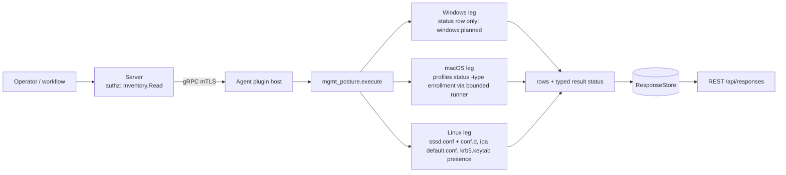

# mgmt_posture

<!-- BEGIN GENERATED: plugin-doc-gen header -->
| | |
|---|---|
| **What it does** | Management-plane posture: which plane controls the device (facts only) |
| **Version** | 1.0.0 |
| **Kind** | Collector · read-only · gathered (crossplatform.security.mgmt_posture) |
| **Platforms** | Windows 🟡 planned · macOS ✅ · Linux ✅ |
| **Actions** | `posture` (definition `crossplatform.security.mgmt_posture`) |
| **Security** | securable `Inventory` · operation Read · risk Low · dispatch ReadOnly · approval gate None |
| **Roles** | execute: endpoint-admin, endpoint-operator · author: content-author |
<!-- END GENERATED -->

## How it works

`posture` reports which management plane controls the device, as facts only. It reads local configuration (Linux) or asks one built-in tool (macOS) and changes nothing. The first row is always a `status` row saying whether the read was complete; the data rows follow. The AD domain, OU and joined rows belong to `device_identity` and are never repeated here.

On Linux the leg reads `/etc/sssd/sssd.conf` and the `/etc/sssd/conf.d/*.conf` snippets (main file first, then snippets in byte order, parsed once so the last value wins as in SSSD) and derives the plane from the first active SSSD domain whose `id_provider` is `ad` or `ipa`; otherwise a `/etc/ipa/default.conf` with a realm means `ipa`, otherwise `none`. `/etc/krb5.keytab` is checked for presence only and is never opened. Every read separates present, absent and refused: a refused `sssd.conf` is `permission_denied` with plane `unknown`, never "not joined". On macOS the leg runs `/usr/bin/profiles status -type enrollment` through the bounded runner and reports MDM enrolment and the MDM server host; any runner failure or unrecognised output is `CONSTRAINED` with no data rows. Windows is planned (caveat 3).



## OS capability

<!-- BEGIN GENERATED: plugin-doc-gen capability -->
| Action | Windows | macOS | Linux |
|---|---|---|---|
| `posture` | 🟡 planned · rung 1 · NetGetJoinInformation + HKLM\\SOFTWARE\\Microsoft\\Enrollments and CloudDomainJoin\\JoinInfo registry reads | ✅ supported · rung 2 · subprocess_runner:/usr/bin/profiles status -type enrollment | ✅ supported · rung 1 · /etc/sssd/sssd.conf + /etc/sssd/conf.d/*.conf active domains, /etc/ipa/default.conf and /etc/krb5.keytab presence (bounded file reads) |

**Declared limits per leg** (descriptor fallback text, verbatim):

- **`posture` / Windows** — not read yet: one unsupported status row, windows:planned
- **`posture` / macOS** — MDM enrolment only; AD binding is device_identity.domain; Jamf not read
- **`posture` / Linux** — configuration as written, not the live join state; a 0600 sssd.conf reports permission_denied, never not-joined
<!-- END GENERATED -->

## Privileges and prerequisites

| OS | Runs as | Extra grant needed | Measured | If the read is refused |
|---|---|---|---|---|
| Windows | n/a — the leg reads nothing (caveat 3) | n/a | n/a | n/a — the placeholder reports `unsupported` with `windows:planned` |
| macOS | agent daemon, default account | None: `profiles status` reports enrolment to an unprivileged caller | Not yet measured on the agent account; see Sample output for the capture | `CONSTRAINED` / partial with a `subprocess_runner:*` or `macos:mgmt_posture:profiles:*` token and no data rows |
| Linux | agent daemon, dedicated unprivileged account (`yuzu`), never root by design (`docs/agent-privilege-model.md`) | None to read, but `/etc/sssd/sssd.conf` is 0600 root by default, so the account cannot read it unless granted | Not measured on the `yuzu` account: a root capture bypasses permission bits | `PERMISSION_DENIED` / partial with `linux:mgmt_posture:sssd_conf:permission_denied` (or `...:sssd_conf_d:permission_denied`) and plane `unknown`; never reported as not joined |

No shell interpreter and no network use. The macOS leg runs one fixed absolute argv through the bounded runner (sink `mgmt_posture/run_macos#1`); the Linux leg is an in-process, bounded read of local files.

## Data contract

### Inputs

<!-- BEGIN GENERATED: plugin-doc-gen inputs -->
The action takes no parameters.
<!-- END GENERATED -->

### Outputs

Every row is pipe-delimited; field 0 is the row kind and the first row is always `status|posture|<supported\|constrained\|permission_denied\|unsupported>|<reason or ->`. The data kinds are `plane`, `mdm_enrolled`, `mdm_provider`, `tenant_id` and `krb5_keytab`, each `kind|value`; `-` is an absent value. Linux emits all five (the three MDM rows as `-`), macOS emits `plane|-` plus the three MDM rows, and neither emits a row for what the other measures. `tenant_id` is reserved and always `-` today. `plane` is `unknown` only when a read was refused. `krb5_keytab|-` means presence could not be determined (caveat 5). Free text is escaped for the server's pipe grammar (`safe_output_field`). `mgmt_posture` is not in the server's key/value plugin set, so rows are decoded as pipe-separated fields.

<!-- BEGIN GENERATED: plugin-doc-gen outputs -->
**`crossplatform.security.mgmt_posture` — `row_kind|field_1|field_2|field_3`**

| Field | Type | Values | Available | Example | Description |
|---|---|---|---|---|---|
| `row_kind` | string | `status` `plane` `mdm_enrolled` `mdm_provider` `tenant_id` `krb5_keytab` | Windows, Linux, macOS | `plane` | Row shape discriminator (field 0). Values: status, plane, mdm_enrolled, mdm_provider, tenant_id, krb5_keytab. |
| `field_1` | string | - | Windows, Linux, macOS | `none` | status: the literal "posture". plane: none, workgroup, ad, aad, hybrid, ipa or unknown (unknown only on a refused read; "-" on macOS). mdm_enrolled: true, false or "-". mdm_provider: the MDM server host, or "-". tenant_id: always "-" today. krb5_keytab: present, absent, or "-" when presence could not be determined. |
| `field_2` | string | `supported` `constrained` `permission_denied` `unsupported` | Windows, Linux, macOS | `supported` | status: supported, constrained, permission_denied or unsupported (Windows, and a leg that threw). Not used by the other kinds. |
| `field_3` | string | - | Windows, Linux, macOS | `-` | status: reason token(s) for a non-supported read, "-" when complete; tokens look like linux:mgmt_posture:sssd_conf:permission_denied, macos:mgmt_posture:profiles:exit_nonzero, subprocess_runner:deadline, windows:planned. Not used by the other kinds. |
<!-- END GENERATED -->

### Result status

`posture` sets `OK`/`FULL` when every read completed, including a host with no management plane (`plane|none`). A read that failed for a reason other than the file being absent makes the result `CONSTRAINED`/`PARTIAL` (or `PERMISSION_DENIED`/`PARTIAL` when `sssd.conf`, the `conf.d` directory or a snippet was refused), with the same tokens in the leading `status` row. No exception crosses the plugin boundary: a leg that throws is reported as an `unsupported` status row and `UNAVAILABLE` (the last status row wins if the leg had already written one).

| Status | Completeness | Provenance | When |
|---|---|---|---|
| `OK` | full | (empty) | every read completed; a host with no SSSD and no IPA is `plane\|none` |
| `CONSTRAINED` | partial | `linux:mgmt_posture:sssd_conf:<errno token>`, `linux:mgmt_posture:sssd_conf:no_domains_key`, `linux:mgmt_posture:sssd_conf:invalid_bytes`, `linux:mgmt_posture:sssd_conf_d:<errno token>`, `linux:mgmt_posture:sssd_conf_d:too_many`, `linux:mgmt_posture:ipa_default_conf:<errno token>`, `linux:mgmt_posture:krb5_keytab:<errno token>` | Linux: a read failed other than by refusal of `sssd.conf` or `conf.d` or by absence (an IPA file refusal is only constrained, the realm is also visible in `sssd.conf`; `too_many`: more than 32 `.conf` snippets, or more than 4096 directory entries, in `/etc/sssd/conf.d`); the plane is still classified from what was read. `<errno token>` is one of `permission_denied`, `eio`, `eloop`, `enotdir`, `enametoolong`, `not_regular`, `oversized` or `errno_<n>` |
| `CONSTRAINED` | partial | `macos:mgmt_posture:profiles:exit_nonzero`, `macos:mgmt_posture:profiles:output_truncated`, `macos:mgmt_posture:profiles:unrecognised_output` | macOS: `profiles` exited nonzero, its output was truncated, or it printed neither enrolment key (a changed or empty output); no data rows |
| `CONSTRAINED` | partial | `subprocess_runner:deadline`, `subprocess_runner:cancelled`, `subprocess_runner:signaled`, `subprocess_runner:line_limit`, `subprocess_runner:spawn_error` | macOS: `/usr/bin/profiles` could not be started, the run timed out, was cancelled, was killed by a signal or hit the 16-line cap; no data rows |
| `PERMISSION_DENIED` | partial | `linux:mgmt_posture:sssd_conf:permission_denied`, `linux:mgmt_posture:sssd_conf_d:permission_denied` | Linux: `sssd.conf`, the `conf.d` directory or a snippet could not be read; plane is `unknown` |
| `UNAVAILABLE` | unknown | `windows:planned` | Windows: one `status\|posture\|unsupported\|windows:planned` row (caveat 3) |
| `UNAVAILABLE` | unknown | `windows:leg:exception` / `linux:leg:exception` / `macos:leg:exception` | a leg threw: an `unsupported` status row (the last status row wins if the leg had already written one), reported instead of unwinding across the plugin boundary |

### Where the data goes

- **Instruction result.** Rows travel over the agent's mTLS gRPC channel as the command response and land in the ResponseStore, queryable at `/api/responses/{id}`. `posture` is also a gathered definition (`crossplatform.security.mgmt_posture`, 3600s TTL).
- **Not consumed by** daily-sync, TAR, DEX, or metrics.
- **Sensitivity.** The MDM server host and the management plane are organisation-level facts; no person is named. The SSSD domain name that decides the plane is used internally and is never emitted. Only the host of the MDM server URL is kept (no path or query, which can carry a token). Key material is never read: the keytab is a presence check only.
- **Siblings:** `device_identity` (owns the domain, OU and joined rows) and `local_security_policy` (local policy, not management plane).

## Sample output

<!-- BEGIN GENERATED: plugin-doc-gen samples -->
**macOS** — captured: macos macOS 26.6.2 arm64 · bare-metal · 2026-10-04 · euid 501 (jsmith) · leg-hash b7575b7af2a2

```
== action=posture
status|posture|supported|-
plane|-
mdm_enrolled|false
mdm_provider|-
tenant_id|-
[result_status] OK / FULL
```

**Linux** — captured: linux Debian GNU/Linux 13 (trixie) aarch64 · container · 2026-10-04 · euid 0 · leg-hash b7575b7af2a2

```
== action=posture
status|posture|supported|-
plane|none
mdm_enrolled|-
mdm_provider|-
tenant_id|-
krb5_keytab|absent
[result_status] OK / FULL
```
<!-- END GENERATED -->

## Caveats and known gaps

1. **No documented customer driver.** No documented customer driver for this plugin was found (as in `local_security_policy`'s caveat); the reason it exists is the `device_identity` gap where a root-only `sssd.conf` reads as "not joined". Pure capability-gap reasoning.
2. **Configuration, not live state.** Linux reports what the files say, not whether the join is healthy. `conf.d` snippets are merged in byte order, not SSSD's locale collation, so a mixed-case snippet set can differ. Only snippets ending `.conf` are read (at most 32, 64 KiB each). `plane|none` means no SSSD AD or IPA domain was found: a host managed through `ldap`, `proxy` or `files` providers, or through winbind without SSSD, also reports `none`.
3. **Windows is planned.** The join and enrolment read (`NetGetJoinInformation`, the Enrollments and CloudDomainJoin registry keys) is not implemented; the leg reports one `unsupported` row, `windows:planned`.
4. **Narrow scope.** macOS reports MDM enrolment only (Jamf is not read) and its `plane` is `-`: AD binding is `device_identity.domain`. No UPN or e-mail field exists; `tenant_id` is reserved and `-`.
5. **Absent versus unknown.** `krb5_keytab|-` means presence could not be determined (a non-ENOENT `access()` failure, with a constrained token), not that the file is absent. The keytab is never opened.

## Source and tests

<!-- BEGIN GENERATED: plugin-doc-gen source -->
- Plugin: `agents/plugins/mgmt_posture/src/mgmt_posture_legs.hpp` · `agents/plugins/mgmt_posture/src/mgmt_posture_linux.cpp` · `agents/plugins/mgmt_posture/src/mgmt_posture_macos.cpp` · `agents/plugins/mgmt_posture/src/mgmt_posture_parsers.hpp` · `agents/plugins/mgmt_posture/src/mgmt_posture_plugin.cpp` · `agents/plugins/mgmt_posture/src/mgmt_posture_win.cpp`
- Definitions: `content/definitions/mgmt_posture.yaml`
- Capability rows: `server/core/src/capability_decls/plugin_action_catalogue_mgmt_posture.hpp`
- Tests: `tests/test_mgmt_posture_definition.py` · `tests/unit/test_mgmt_posture_legs.cpp` · `tests/unit/test_mgmt_posture_local_dispatcher.cpp` · `tests/unit/test_mgmt_posture_parsers.cpp`
- Privilege row: `docs/agent-privilege-model.md`
<!-- END GENERATED -->
