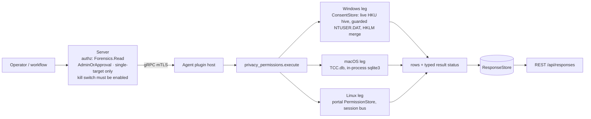

# privacy_permissions

<!-- BEGIN GENERATED: plugin-doc-gen header -->
| | |
|---|---|
| **What it does** | Per-app sensitive-permission grants -- camera, microphone, location, full-disk-access equivalents (read-only) |
| **Version** | 1.0.0 |
| **Kind** | Collector · read-only · gathered (crossplatform.privacy_permissions.permissions) |
| **Platforms** | Windows 🟡 constrained · macOS 🟡 constrained · Linux 🟡 constrained |
| **Actions** | `permissions` (definition `crossplatform.privacy_permissions.permissions`) |
| **Security** | securable `Forensics` · operation Read · risk High · dispatch ReadOnly · approval gate AdminOrApproval |
| **Roles** | execute: admin · author: content-author |
<!-- END GENERATED -->

## How it works

One action, `permissions` (`privacy_permissions_plugin.cpp`), reports per-app sensitive-permission grants for four categories -- camera, microphone, location, full-disk-access -- as rows `permissions|<os>|<app_id>|<category>|<state>|<raw>|<last_used_start>|<last_used_stop>` (the leading field is the definition's `row_kind` column). The action takes no parameters. Every leg is rung 1 and an in-process read: no PowerShell and no subprocess on any OS.

- **macOS** reads `TCC.db` in-process (never a `sqlite3` CLI shellout) and never writes to a TCC file (SQLite may spill temporary data under `$TMPDIR`). It opens each `TCC.db` read-only once (`O_NOFOLLOW_ANY`) and SQLite reads that descriptor through `/dev/fd/N` with `immutable=1`: no lock, and SQLite opens or creates no `-journal`, `-wal` or `-shm`. The plugin only `lstat()`s those names and refuses a database that has one, is WAL-mode, is not a regular SQLite file of 1 byte to 4 MiB, or changes during the read (inode, size, mtime, ctime and the header change counter are compared before and after), so a concurrent `tccd` commit reads `unreadable` and uncommitted `tccd` writes are invisible. The mount table is read once per run (`getmntinfo_r_np(MNT_NOWAIT)`, the kernel's cache, never a call into a remote server) and a path on or under a network-backed mount (`nfs`, `smbfs`, `webdav`, `afpfs`, `autofs`, `macfuse`, `osxfuse` and the rest of the shared deny-list) is refused before any call touches it. The database is opened first with `O_NOFOLLOW_ANY`, so a symlink anywhere in the path is refused (`open_failed:symlink`) without being followed. It queries the `access` table for the three TCC-governed categories (camera, microphone, full-disk-access) in two kinds of source: the **system** `/Library/Application Support/com.apple.TCC/TCC.db` (rows unqualified) and **each user's own** `~/Library/Application Support/com.apple.TCC/TCC.db` for every real home directly under `/Users` (a directory, not a symlink, owned by uid 500 or above -- the `autoruns` rule), rows qualified `<user>/<app_id>` (the home folder name). Per-user rows are what that user's own, user-writable file says: they do not attest what `tccd` enforces, and system-db (MDM) precedence is not modelled. Camera and microphone grants normally live in the per-user databases (measured on one non-MDM Mac; MDM PPPC entries likely land in the system database). `auth_value` 0 is `denied`, 2 and 3 (`limited`: a scoped grant) are `allowed`, and anything else, 1 included, is `prompt_undetermined` with the true value in `raw`; the `access` schema and this mapping are proven on macOS 26.6.2 only (an unknown schema reads `prepare_failed`, but a changed meaning of a value would not be noticed). SQLite runs in its defensive, untrusted-schema and cell-size-check modes, and every source is bounded: a 64 KiB schema parse limit, 1024 rows per service, a 1024-byte value limit, 1 MiB retained and 500 ms per source, at most 4096 `/Users` entries, and a 10 s time budget and 16 MiB of output per run (every source and enumeration row is counted at its formatted length, escapes and separators included, while the last fixed `location` row and the `collection:budget_exceeded` row are not; the cap is checked between sources, so the real bound is 16 MiB plus the source that crosses it). The time budgets are enforced by SQLite's progress handler and between services; they start before the file is opened but cannot interrupt `lstat`, `open` or `read` (caveat 3). `location` is administered by `locationd` outside TCC entirely (ADR-3003) and ships as its own explicit `unsupported` row on every collection.
- **Windows** reads three levels of the `CapabilityAccessManager\ConsentStore` registry tree in-process. The agent runs as LocalSystem, so `HKEY_CURRENT_USER` is never an interactive user's; the leg enumerates the real profiles from `HKLM\...\ProfileList` (service accounts filtered out) and reads each profile's `ConsentStore` through the shared hive ladder: the loaded `HKU\<SID>` hive first, else an offline `NTUSER.DAT` mount (`RegLoadKeyW`, `SeBackup`/`SeRestore`, held under the process-wide offline-hive lock, unloaded unread on any refusal), plus the machine-wide `HKLM` `ConsentStore`. The registry value names `webcam`, `microphone`, `location` and `broadFileSystemAccess` map to `camera`, `microphone`, `location` and `full_disk_access`; Windows `full_disk_access` is Settings' "File system" toggle (`broadFileSystemAccess`), not a macOS-style Full Disk Access grant. Per capability the rows are the capability toggle (`app_id` `-`), the NonPackaged toggle ("let desktop apps access", `NonPackaged`) and each app key; a per-app NonPackaged key has no decision of its own, so it reads `absent` beside its last-used times (usage-class: a presence proxy, not a grant). The `HKLM` value is the device toggle: a successfully read `HKLM` `Deny` overrides a profile's value for the same key (most restrictive wins); an `HKLM` `Allow` defers to the user's own value and is reported once as an unqualified `HKLM` row. The offline arm is guarded, for this plugin only: a UNC or non-fixed-drive path is refused; every ancestor directory is opened hop by hop from the drive root and refused if it is a reparse point; the `NTUSER.DAT` itself is checked from its own handle (not a reparse point, a regular disk file, owned by the profile, LocalSystem or Administrators, final path equal to the requested one, at most 512 MiB, not an offline or cloud-recall placeholder); the `NTUSER.DAT*` transaction-log sidecars beside it are refused if a reparse point (from the directory listing and again from the opened handle) or hard-linked (or more than 64); `RegLoadKeyW` takes a path, so the file's identity is re-verified after the load and a changed file is unloaded unread (`hive_identity_changed`). Stability is shown, not assumed: a `RegNotifyChangeKeyValue` watch is armed on each `ConsentStore` root before its walk and polled after, so a change the API reports discards that read and the source is walked once more (not once the deadline has passed), and a source that changed again during its one re-walk, or whose deadline left no time for one, is refused (`changed_during_read`); a watch that cannot be created, armed or polled refuses it too. An offline mount rewrites the hive's sequence number and hash (issue #4977, verified): reading a logged-off profile is not forensically neutral. The load is read-write, so Windows may apply the hive's pending transaction logs (`NTUSER.DAT.LOG1`/`LOG2`) -- standard recovery, the same as at the next logon -- and that is the disclosed forensic side effect. The run has a cooperative 15 s deadline checked before each profile, first thing in the hive-file guard's `before_load` and before each capability and each app key open; there is no detached worker, so a single blocking call (waiting on a sibling plugin's offline arm, `RegLoadKeyW`) is not interrupted and can overrun it, as can one enumeration of at most 4,096 children, a capability-level key open or one key's value reads. Output is bounded by a 16 MiB run budget with `HKLM`'s rows reserved first.
- **Linux** calls `org.freedesktop.impl.portal.PermissionStore.Lookup` over the agent process's **own** session D-Bus (`sd_bus_open_user`) -- it never reaches another user's session. Each table is decoded on its own terms: a `devices` record (`camera`, `microphone`) is one of `yes`/`no`/`ask`, a `location` record is `[accuracy, timestamp]` where `NONE` is a refusal and `COUNTRY`/`CITY`/`NEIGHBORHOOD`/`STREET`/`EXACT` a grant; any other value is `prompt_undetermined` with the list kept in `raw`; rows are sorted by `app_id`. No session bus or no portal daemon is `unsupported`/`UNAVAILABLE` (provenance `portal:unavailable`), not a failure. The three lookups share one 5-second total deadline; a lookup that runs out of it reads `<category>:timeout`.



## OS capability

<!-- BEGIN GENERATED: plugin-doc-gen capability -->
| Action | Windows | macOS | Linux |
|---|---|---|---|
| `permissions` | 🟡 constrained · rung 1 · HKLM ProfileList enumeration, then each real profile's SOFTWARE\\Microsoft\\Windows\\CurrentVersion\\CapabilityAccessManager\\ConsentStore via its loaded HKU\\<SID> hive or an offline NTUSER.DAT mount (RegLoadKeyW, SeBackup/SeRestore), plus the same HKLM ConsentStore path | 🟡 constrained · rung 1 · TCC.db read-only, in-process sqlite3 over one descriptor with an immutable URI (no lock, no -journal/-wal/-shm ever opened or created; a WAL-mode or journal-bearing file is refused, and a file that changes during the read is discarded): the system /Library/Application Support/com.apple.TCC/TCC.db plus each /Users/<home> (uid >= 500) per-user Library/Application Support/com.apple.TCC/TCC.db | 🟡 constrained · rung 1 · xdg-desktop-portal org.freedesktop.impl.portal.PermissionStore.Lookup over the agent process's own session bus (sd_bus_open_user) |

**Declared limits per leg** (descriptor fallback text, verbatim):

- **`permissions` / Windows** — reads each real profile's ConsentStore from its loaded HKU hive first, else from NTUSER.DAT under SeBackup/SeRestore (a UNC, non-fixed-drive, reparse-point or reparse-ancestor, redirected, oversized or foreign-owned hive file is refused, and one whose identity changes across the load is unloaded unread); a ConsentStore change RegNotifyChangeKeyValue reports during the read is walked once more, and a source that changed again, or whose deadline left no time for the re-walk, is refused, never guessed; HKLM Deny overrides a profile (most restrictive wins); per-app NonPackaged rows carry last-used times but no decision; a cooperative 15 s deadline and a 16 MiB output budget
- **`permissions` / macOS** — every TCC.db is TCC-protected: without Full Disk Access each read is denied; camera and microphone grants normally live in the per-user dbs; per-user rows report what that user's own TCC.db records, not what tccd enforces; homes outside /Users or on a network mount are not read; location is unsupported (locationd, outside TCC)
- **`permissions` / Linux** — never another user's session: a system-service agent has no session bus in every shipped deployment and reports unavailable, which says nothing about interactive users' grants; only portal-mediated grants are visible (an app opening the device directly never appears); full_disk_access is unsupported (no portal equivalent)
<!-- END GENERATED -->

## Privileges and prerequisites

| OS | Runs as | Extra grant needed | Measured | If the read is refused |
|---|---|---|---|---|
| macOS | agent daemon, root today (LaunchDaemon carries no `UserName` key -- `docs/agent-privilege-model.md` TL;DR) | Every `TCC.db` -- the system one and each per-user one -- is TCC-protected regardless of privilege level; a separate Full Disk Access (FDA) grant is needed (how to grant it to the agent is not yet measured) | 2026-09-23 (sample recaptured 2026-09-29), this Mac (`braga`), euid 501 with ambient FDA (NOT the production agent identity): the system db and the per-user db both read (per-user microphone grants visible). The same run with both TCC directories read-denied (a `sandbox-exec` deny profile, standing in for a non-FDA identity) reported both sources `denied`, `PERMISSION_DENIED`/`PARTIAL`. Not measured: the production root LaunchDaemon's own outcome, how to grant it Full Disk Access, and the verbatim `sqlite3_errmsg` a real TCC refusal produces | A refused `open` (`EPERM`/`EACCES`), `SQLITE_AUTH`/`SQLITE_PERM`, or `SQLITE_CANTOPEN` whose underlying syscall failed `EPERM`/`EACCES` on a file that is there, reports that source's whole-source row `denied` (`tcc_db:open_failed:errno_<n>`, `<user>:tcc_db:open_failed:errno_<n>`, `...:open_failed:<msg>`), `PERMISSION_DENIED`/`PARTIAL`. An agent without FDA sees this for every source |
| Windows | agent service, LocalSystem; `SeBackupPrivilege`/`SeRestorePrivilege` are enabled only inside the offline-hive arm, under the process-wide offline-hive lock | None for a loaded hive; the offline arm needs the two privileges LocalSystem already holds | Live-hive read on the-rig (Windows 10.0.26200), 2026-09-23. The offline arm, hive-file guard and stability watch: measured on the-rig as SYSTEM, 2026-10-02 (Windows 10.0.26200, bare-metal -- the sample's stamp records the date and host). The rig re-verification covers the last code-bearing commit (compile, tests under both identities, hostile-shape, `after_load`-refusal, embedded-NUL-key, offline-placeholder and sidecar probes, a profile with real kernel-created sidecars accepted, committed-sample rows byte-identical); the commits after it change comments, docs and generated JSON only. The narrative is in the PR description | A refused registry read (`ERROR_ACCESS_DENIED`) reports that source or key `denied` (`<profile>:access_denied`, `<profile>:<category>:value_access_denied`), `PERMISSION_DENIED`/`PARTIAL`; a missing privilege reports `<profile>:privilege_missing` `denied`; a refused or unsafe hive file reports `<profile>:<hive_* token>` `unreadable` |
| Linux | agent daemon, default (a service user with no session bus) | None -- the portal call is an ordinary session-bus D-Bus method call, which the agent's own session must offer | 2026-09-23, Debian 13 container, `xdg-desktop-portal` 1.20.3's permission store seeded with test records: the `devices` and `location` Lookups decoded as above. Not measured on a desktop user's real session | A refused session-bus socket (`session_bus:access_denied`) or an `AccessDenied`-shaped D-Bus error (`<category>:access_denied`, on that category's own row) reports `denied`, `PERMISSION_DENIED`/`PARTIAL`; a malformed reply reports `unreadable` with `<category>:shape` |

Binaries/subprocesses: none -- every leg is an in-process read (SQLite, the Windows registry API, sd-bus). Network: the Linux leg's D-Bus call is local-machine IPC only, never a network socket.

## Data contract

### Inputs

<!-- BEGIN GENERATED: plugin-doc-gen inputs -->
The action takes no parameters.
<!-- END GENERATED -->

### Outputs

One row per app per category, led by `row_kind` `permissions` (`constrained` only on the one internal-error row, `constrained|<os>|-|-|unreadable|internal_error|-|-`, which keeps the same field count). Every category of every source is a row -- its decoded grants, `absent` when the source cleanly holds none, `unsupported` when no mechanism reaches it (macOS `location`, Linux `full_disk_access`), or a failure row -- or is covered by a whole-source row (`category` `-`) for a source that could not be read at all, or that holds no file (a macOS user with no per-user `TCC.db`, `absent`). `denied` covers two facts, kept as one state: a decoded refusal, whose `raw` is the native value (`Deny`, `0`, `no`, `NONE,<timestamp>`), and a refused read, whose `raw` is a `<subject>:<cause>` failure token (the agent-log provenance carries it too, except Windows per-app failures, which reach it as the coarse `<source>:<category>:<cause>`; the row sanitizer writes a `\` in a token as `/`) and whose `category` is `-` when the whole source was refused; `unreadable` always carries a token. `app_id` `-` means no specific app (on Windows, the capability's own toggle; `NonPackaged` is the desktop-apps toggle); a row from a per-user source is qualified `<user>/<app_id>` (each Windows profile, each macOS per-user `TCC.db`); an unqualified `app_id` comes from a machine-wide source (the macOS system `TCC.db`, the Windows HKLM mirror) or, on Linux, from the agent's own session's portal store -- that one session's grants, never machine-wide. On Windows, `last_used_start`/`last_used_stop` read `unreadable` (plus a `...:last_used_start_<cause>` token in the agent log) when the value exists but is not an 8-byte `REG_QWORD` or could not be read.

<!-- BEGIN GENERATED: plugin-doc-gen outputs -->
**`crossplatform.privacy_permissions.permissions` — `row_kind|os|app_id|category|state|raw|last_used_start|last_used_stop`**

| Field | Type | Values | Available | Example | Description |
|---|---|---|---|---|---|
| `row_kind` | string | `permissions` `constrained` | Windows, Linux, macOS | `permissions` | Row family: `permissions` (every data row) or `constrained` (the one row the plugin writes when it fails internally: `raw` is `internal_error`, the result is CONSTRAINED). |
| `os` | string | `macos` `windows` `linux` | Windows, Linux, macOS | `macos` | The reporting OS. |
| `app_id` | string | - | Windows, Linux, macOS | `com.example.App` | Per-app identifier: a TCC client id (bundle id or path, macOS), an executable path or Package Family Name (Windows), a portal-reported app id (Linux). "-" means no specific app: a Windows capability-level toggle, a per-category `absent`/ `unsupported` row, or a failure row. On Windows `NonPackaged` is the capability's "let desktop apps access" toggle; a desktop app's own row reads `absent` (it stores no decision) and is governed by that toggle. A row read from a PER-USER source is qualified with that user's name -- `<user>/<app_id>` or `<user>/-` on the wire (the row sanitizer writes the separator `\` as `/`, as it does inside every path): each Windows profile's ConsentStore and each macOS per-user TCC.db. An unqualified app_id comes from a machine-wide source (the macOS system TCC.db, the Windows HKLM ConsentStore mirror) or, on Linux, from the portal store of the agent's OWN session -- that one session's grants, never machine-wide. |
| `category` | string | `camera` `microphone` `location` `full_disk_access` `-` | Windows, Linux, macOS | `camera` | The fixed cross-OS permission category. "-" only on a whole-source row -- one row standing for every category of a source that could not be read at all (a TCC.db, a Windows profile hive, ConsentStore root or ProfileList discovery, the session bus/portal, or what a Windows or macOS run left unread once a budget or time limit was spent), or that holds no file (a macOS user with no per-user TCC.db). |
| `state` | string | `allowed` `denied` `prompt_undetermined` `absent` `unreadable` `unsupported` | Windows, Linux, macOS | `allowed` | allowed/denied: a real, decoded grant. `denied` also covers a READ that was refused -- one state for both, told apart by `raw`: a decoded refusal carries the native value (Deny, 0, no, NONE,<timestamp>), a refused read a `<subject>:<cause>` token (and category "-" when the whole source was refused). prompt_undetermined: the mechanism reported a value this plugin does not map to allowed/denied (never guessed) -- a mapped Prompt/ask/macOS auth_value 1 and an unmapped value alike; `raw` keeps the true value. absent: no record for this app+category (or this source) -- not a failure; a Windows NonPackaged app row also reads `absent`, WITH its last-used times: the app stores no decision of its own and its state follows the NonPackaged toggle row. unreadable: the read itself failed; `raw` names why. unsupported: no mechanism reaches this category on this OS/host (macOS location; Linux full_disk_access; Linux with no session bus or portal daemon). |
| `raw` | string | - | Windows, Linux, macOS | `2` | The mechanism-native value behind `state` (a TCC auth_value integer: 0 denied, 2 and 3 allowed, anything else prompt_undetermined; a ConsentStore Value string; a joined portal permission list); on a failure row (`denied` from a refused read, or `unreadable`) the failure token, with `\` written `/` (the agent-log provenance carries it too, except a Windows per-app failure, which reaches it as the coarse `<source>:<category>:<cause>`); "-" when nothing meaningful beyond the state itself. |
| `last_used_start` | string | - | Windows | `1700000000000` | Windows ConsentStore LastUsedTimeStart, epoch milliseconds; "-" when never set or on any other OS; `unreadable` when the value exists but is not an 8-byte REG_QWORD or could not be read (a `...:last_used_start_<cause>` token names it). |
| `last_used_stop` | string | - | Windows | `1700000100000` | Windows ConsentStore LastUsedTimeStop, epoch milliseconds; "-" when never set (a stored 0 also reads "-": conventionally in use now, unmeasured) or on any other OS; `unreadable` when the value exists but is not an 8-byte REG_QWORD or could not be read (a `...:last_used_stop_<cause>` token names it). |
<!-- END GENERATED -->

### Result status

The typed status is recorded with the result (and appears unlabelled in agent-transition events) but is not shown as a label on REST, MCP or the dashboard, so read each row's `state` and `raw`; completeness and provenance reach only the agent log.

| Status | Completeness | Provenance | When |
|---|---|---|---|
| `OK` | `FULL` | — | No read was refused and no failure token exists: every category was read or is `absent`/`unsupported`. Completeness is in the rows: any `unreadable`/`denied` row, or a category `-` row, means a source was not fully read. A host with no grants recorded for any mapped category still reports `OK`. |
| `UNAVAILABLE` | `FULL` | `portal:unavailable` | Linux only: the agent's own account has no session bus, or no portal backend answered any lookup (`ServiceUnknown` on every table). One whole-source row, state `unsupported` (`app_id` and `category` both `-`). Says nothing about interactive users' grants. |
| `CONSTRAINED` | `PARTIAL` | see below | A read failed for a reason other than a refusal; each failed read is its own `unreadable` row naming the token (bar the two agent-log-only cases below). |
| `PERMISSION_DENIED` | `PARTIAL` | see below | At least one read was refused -- a TCC-protected `TCC.db` without Full Disk Access, a refused registry read on Windows, a refused session-bus socket or a portal `AccessDenied` on Linux. Wins over `CONSTRAINED` when both occur. |

Every token is `<subject>:<cause>`; on a failure row it is also the row's `raw`. The complete set this plugin emits today, by leg, with what it means and what to do:

- **macOS, whole source** -- `tcc_db:<cause>` (system db) or `<user>:tcc_db:<cause>` (per-user db). `denied` (the agent lacks Full Disk Access; retrying is futile; how to grant it is unmeasured): `open_failed:errno_<n>` (`EPERM`/`EACCES`), `open_failed:<sqlite msg>`, `prepare_failed:<sqlite msg>` (`SQLITE_AUTH`/`PERM`, or `SQLITE_CANTOPEN` with an `EPERM`/`EACCES` syscall, on a file that is there). `unreadable`, `tccd` mid-write: `changed_during_read`, `sidecar_present` -- retry twice, 30-60 s apart, keyed on the `raw` suffix (no typed status reaches REST or MCP); if it repeats on 3 consecutive runs, suspect a WAL-mode database or a stale sidecar left by a crashed `tccd`: never delete a TCC sidecar (it corrupts the database), restarting `tccd` is expected to recover it (unmeasured). `unreadable`, out of time: `timeout` -- a `timeout` on ONE source that repeats is not retryable (that database is oversized or hostile); a `timeout` on later sources of a run means the 10 s run budget was spent by earlier ones, so retry. `unreadable`, refused file, inspect it: `wal_mode`, `not_sqlite`, `size_out_of_range`, `not_regular`, `open_failed:symlink`. `unreadable`, OS error, the errno or message says which: `missing` (system db only), `network_mount` (the path is under a network-backed mount and was not touched), `read_failed` (`fstat` or `pread` on the opened file failed), `hardening_failed` (SQLite's untrusted-database settings could not be applied, so the source is not read), `open_failed:errno_<n>`, `open_failed:<sqlite msg>`, `prepare_failed:<sqlite msg>`, `query_only_failed:<sqlite msg>` (`<sqlite msg>` is cut to 200 bytes; control characters become spaces and `|` and `\` become `/`).
- **macOS, per category** (`unreadable`; the category is incomplete, rows read before it are kept) -- `<source>:<category>:row_cap` (over 1024 rows: an oversized database), `:byte_cap` (over 1 MiB retained for the source), `:timeout`, `:value_oversized` (a value over the 1024-byte limit: a hostile or corrupt database), `:query_bind_failed`, `:query_step_failed`, and `:auth_value_unreadable` (one grant's `auth_value` was NULL or not an integer; that grant is a row of its own and the category is otherwise complete), where `<source>` is `tcc_db` or `<user>:tcc_db`.
- **macOS, home enumeration** -- `users:open_errno_<n>` and `<user>:home_stat_errno_<n>` (`denied` for EPERM/EACCES, else `unreadable`); `users:fdopendir_errno_<n>`, `users:truncated`, `users:readdir_error` (`unreadable`); `users:network_mount` and `<user>:network_mount` (`unreadable`: the users directory, or that home, is a network-backed mount point and was not touched); `<user>:home_vanished` (`unreadable`: the home disappeared between listing and inspection); `mounts:getmntinfo_failed` (`unreadable`, category `-` with the sources still read: the mount table could not be read, so they were read without the network-mount guard); a home with no row was not read. A source whose own path is under a network mount reads `<source>:network_mount` (`unreadable`). `collection:budget_exceeded` (`unreadable`): the run-wide 16 MiB output cap (checked between sources) stopped the run, so later users' sources were not read.
- **Windows, whole source** -- `<profile>:<cause>`, `hklm:<cause>` or `profiles:<cause>`, on a row with category `-`. `denied`: `access_denied` (a refused live `HKU\<SID>` root), `profiles:profile_list_access_denied`, `profiles:enum_access_denied`, `profiles:profile_key_access_denied`, `profiles:profile_image_path_access_denied`, `<profile>:privilege_missing` (`SeBackup`/`SeRestore` could not be enabled; grant them, or the agent is not LocalSystem). `unreadable`: `hive_not_found`, `profile_path_unreadable`, `hive_mount_failed` (the load failed -- typically a sharing violation while another process holds the hive; retry, and if it repeats run `reg query HKU` and `reg unload` any `YUZU_HIVE_*` mount a failed unload left behind), `invalid_sid`, `profile_list_backup` (a ProfileList entry whose key ends `.bak` -- the `<SID>.bak` Windows leaves after a temporary-profile event: the folder may hold the user's real ConsentStore and was not read; permanent for that host -- the status stays CONSTRAINED/PARTIAL until the stale `.bak` key is removed or the profile repaired, and a retry does not clear it), `profiles:profile_list_unreadable`, `profiles:truncated`, `profiles:enum_win32_<n>`, `profiles:profile_key_win32_<n>` and `profiles:profile_image_path_win32_<n>` (a ProfileList record's key or `ProfileImagePath` failed for a reason other than a refusal), `<profile>:win32_<n>` and `hklm:win32_<n>` (that source's `ConsentStore` root failed to open for a reason other than a refusal); the hive-file refusals `hive_path_unc`, `hive_path_not_fixed`, `hive_path_too_deep`, `hive_path_reparse_ancestor`, `hive_reparse_point`, `hive_not_regular`, `hive_owner_unexpected`, `hive_path_redirected`, `hive_not_resident` (an offline or cloud-recall placeholder file: never loaded, since the load would recall it while the process-wide hive lock is held), `hive_oversized`, `hive_sidecar_reparse`, `hive_sidecar_hardlinked` (a reparse-point or hard-linked transaction-log sidecar next to the hive: the kernel follows such a link as SYSTEM during the load), `hive_sidecar_count` (more than 64 sidecar-named entries), `hive_identity_changed`, `hive_stat_failed:win32_<n>` (the file or an ancestor could not be inspected; a profile whose directory denies traversal reads `win32_5`) -- each means the offline mount was refused or unloaded unread, and the profile's `ProfileImagePath` or its directory tree should be inspected. `hive_mount_failed` is retryable; `hive_oversized`, `hive_owner_unexpected`, `hive_path_reparse_ancestor`, `hive_path_redirected`, `hive_not_resident`, `hive_sidecar_reparse`, `hive_sidecar_hardlinked` and `hive_sidecar_count` are permanent for that profile until its path or file changes (a sidecar token clears once the sidecar is removed or is a regular single-link file), and there is no override; `changed_during_read` (the `ConsentStore` changed during the read and again during its one re-walk, or the deadline left no time for a re-walk: rows discarded, retry) and `notify_event_failed:win32_<n>`, `notify_failed:win32_<n>`, `notify_wait_failed:win32_<n>` (stability could not be observed, so it is not claimed); `timeout` (the deadline passed before this profile's hive was touched); `<source>:budget_exceeded` (one source hit its own 8192-grant or 2 MiB cap; its rows so far are kept). `<profile>:hive_unload_failed` is a token only (the read itself succeeded): a mount may remain, run `reg unload HKU\<mount>` from the agent log line once the holder releases it.
- **Windows, per key** (`unreadable`/`denied` row, `raw` = `<profile>\<app_id>:<category>:<cause>`; the status token drops the app) -- `capability:<win32|access_denied>`, `packaged_app:<cause>`, `nonpackaged_app:<cause>`, `nonpackaged_container:<cause>`, `packaged_enum_truncated`/`nonpackaged_enum_truncated` and `<kind>_enum_<cause>` (over 4096 children, or the enumeration failed), `packaged:name_embedded_nul`/`nonpackaged:name_embedded_nul` (a child key name with an embedded NUL, or with no characters at all, was skipped, one row per walk: it cannot be opened by name (an embedded NUL would read a prefix sibling, an empty name the parent itself), so it is never read), `value_access_denied`, `value_oversized` (over 64 bytes), `value_empty`, `value_type_<n>`, `value_win32_<n>`, `duplicate_app_id` (two keys decode to one app id); `last_used_start_<cause>`/`last_used_stop_<cause>` are token-only, with the field itself `unreadable`.
- **Windows, run** -- `collection:budget_exceeded:profiles_skipped_<n>` (`unreadable`: the 16 MiB output budget stopped the run before a later profile was emitted) and `collection:timeout:profiles_skipped_<n>` (`unreadable`: the cooperative 15 s deadline passed, so the profile in progress may be partial, and later profiles were not read); `n` counts the profiles never emitted -- those after the stop, plus a profile whose rows were dropped for the budget. Automation should match the `collection:budget_exceeded` / `collection:timeout` prefix (Windows appends `:profiles_skipped_<n>`, macOS keeps the bare token); profiles are read in ProfileList enumeration order and the action takes no parameters, so a run that stops at the deadline tends to skip the same tail each time.
- **Linux** -- `session_bus:access_denied` (`denied`), `session_bus:open_errno_<n>` (`unreadable`); `<category>:access_denied` (`denied`); `<category>:lookup_failed`, `<category>:timeout` (the shared deadline ran out), `<category>:shape`, `<category>:entry_shape`, `<category>:service_unknown` (some lookups reached no portal), `<app_id>:<category>:empty_permissions` (the portal returned an app with no permission value -- no decision, never `denied`), `portal:not_built` (built without libsystemd) (`unreadable`).
- **All** -- `internal_error` (the `constrained` row).

### Where the data goes

- **Instruction result.** Rows go to the standard `ResponseStore`, kept 90 days (`--response-retention-days`, default 90), and are served over `GET /api/responses` (legacy), `GET /api/v1/responses/{id}` and the equivalent MCP result-poll tools.
- **Not consumed by** daily-sync, TAR, DEX, or metrics.
- **Sensitivity.** Names, per app on a specific machine, whether that app currently holds live audio/video/location/filesystem-access capability. Rows carry the profile or home folder name (normally the local account name) as the `<user>/` qualifier on macOS and Windows rows -- never a SID or token, though nothing filters an e-mail-shaped Windows profile folder name -- app ids can embed profile paths, and Windows last-used times are usage-class behavioural data; user names in the samples are replaced with `jsmith`. Dispatch is gated `Forensics:Read` + `AdminOrApproval`, but stored rows are readable by any `Response:Read` holder (Administrator, Operator, Viewer, PlatformEngineer and ITServiceOwner by default; any authenticated session while RBAC is off) -- audited as `response.read` (REST v1 `/responses/{id}`, `/aggregate`, `/export`), `execution.detail.fetch` (`/executions/{id}/responses`) and `mcp.query_responses`; the legacy `/api/responses` routes and the dashboard results view write only a scope-drop `denied` row, never a success row. There is no per-user erasure path.
- **Default-off, single-target.** No dispatch succeeds until an operator enables the plugin with `PUT /api/v1/plugin-config/privacy_permissions/kill-switch {"enabled":true}` (`PluginConfig:Write`, audited as `plugin_config.kill_switch.set`; the MCP twin is `set_plugin_kill_switch`). Dispatch needs `Forensics:Read` + `AdminOrApproval` (Administrator by default; a non-admin needs a delegated `Forensics:Read` grant plus an approval) and names exactly one device. While it is off, REST `/api/command` answers "permission denied: Forensics:Read" even to an Administrator, the dashboard console says "No agents connected", MCP returns an "emergency stop" message, and instruction execute answers 503 "no agents reached ... concurrency claim" (misleading; check the switch first). The switch is per plugin, not per OS: a fleet that already enabled `privacy_permissions` for Linux or macOS reads Windows profiles on upgrade (dispatch is still `AdminOrApproval`, single-target and audited). Disabling stops new dispatches; a delayed or staggered command already sent still runs (up to 10 minutes).
- **Siblings:** `execution_artifacts` (the other Forensics-class Windows-evidence plugin).

## Sample output

<!-- BEGIN GENERATED: plugin-doc-gen samples -->
**Windows** — captured: windows Windows 10.0.26200 x86_64 · bare-metal · 2026-10-02 · LocalSystem (elevated; account names replaced with jsmith) · leg-hash 6f22f62118ed

```
== action=permissions
permissions|windows|jsmith/-|camera|allowed|Allow|-|-
permissions|windows|jsmith/-|full_disk_access|allowed|Allow|-|-
permissions|windows|jsmith/-|location|allowed|Allow|-|-
permissions|windows|jsmith/-|microphone|allowed|Allow|-|-
permissions|windows|jsmith/5319275A.WhatsAppDesktop_cv1g1gvanyjgm|camera|denied|Deny|-|-
permissions|windows|jsmith/5319275A.WhatsAppDesktop_cv1g1gvanyjgm|location|allowed|Allow|-|-
permissions|windows|jsmith/C:/PROGRA~2/Citrix/ICACLI~1/HdxRtcEngine.exe|camera|absent|-|1699446591317|1699448586363
permissions|windows|jsmith/C:/PROGRA~2/Citrix/ICACLI~1/HdxRtcEngine.exe|microphone|absent|-|1699446611274|1699448585475
permissions|windows|jsmith/C:/PROGRA~2/Citrix/ICACLI~1/wfica32.exe|microphone|absent|-|1727429693627|1727429699770
permissions|windows|jsmith/C:/Program Files (x86)/Steam/bin/cef/cef.win7x64/steamwebhelper.exe|microphone|absent|-|1672318772321|1672318774367
permissions|windows|jsmith/C:/Program Files (x86)/Steam/steam.exe|microphone|absent|-|1737300284911|1737312589346
permissions|windows|jsmith/C:/Program Files (x86)/ZoomCitrixHDXMediaPlugin/Zoom.exe|camera|absent|-|1732527131754|1732528329384
… 12 of 121 rows shown
[result_status] OK / FULL
```

**macOS** — captured: macos macOS 26.6.2 arm64 · bare-metal · 2026-09-29 · euid 501 (ambient FDA, NOT the production agent identity -- see leg banner; account names replaced with jsmith) · leg-hash 6f22f62118ed

```
== action=permissions
permissions|macos|-|camera|absent|-|-|-
permissions|macos|-|microphone|absent|-|-|-
permissions|macos|/Library/PrivilegedHelperTools/com.microsoft.autoupdate.helper|full_disk_access|denied|0|-|-
permissions|macos|/usr/libexec/sshd-keygen-wrapper|full_disk_access|allowed|2|-|-
permissions|macos|com.microsoft.VSCode|full_disk_access|allowed|2|-|-
permissions|macos|com.nordvpn.macos|full_disk_access|denied|0|-|-
permissions|macos|com.spotify.client|full_disk_access|denied|0|-|-
permissions|macos|net.whatsapp.WhatsApp|full_disk_access|denied|0|-|-
permissions|macos|jsmith/com.microsoft.teams2|camera|allowed|2|-|-
permissions|macos|jsmith/org.whispersystems.signal-desktop|camera|allowed|2|-|-
permissions|macos|jsmith/com.microsoft.teams2|microphone|allowed|2|-|-
permissions|macos|jsmith/org.whispersystems.signal-desktop|microphone|allowed|2|-|-
… 12 of 14 rows shown
[result_status] OK / FULL
```

**Linux** — captured: linux Debian GNU/Linux 13 (trixie) aarch64 · container · 2026-09-25 · euid 0 · leg-hash 6f22f62118ed

```
== action=permissions
permissions|linux|org.example.CamApp|camera|allowed|yes|-|-
permissions|linux|org.example.MicApp|microphone|denied|no|-|-
permissions|linux|org.example.MapApp|location|allowed|EXACT,0|-|-
permissions|linux|org.example.NoLocApp|location|denied|NONE,0|-|-
permissions|linux|-|full_disk_access|unsupported|-|-|-
[result_status] OK / FULL
```
<!-- END GENERATED -->

## Caveats and known gaps

1. **Why this plugin exists, and why it is off by default.** Gives an investigator forensic visibility into which apps currently hold camera/microphone/location/full-disk-access grants on an endpoint -- useful when following up a suspected compromise or a policy violation. No specific customer or compliance-framework request drove it; it was built ahead of demand, matching the other Forensics-tier plugins' cadence. Because it reads sensitive per-app/per-user permission state, it ships default-off (`Forensics:Read` + `AdminOrApproval`) like every other Forensics-class plugin, and stays off until an operator explicitly enables it. Reads one machine per request; Linux reports only the agent's own session, normally `unavailable` under the shipped service.
2. **macOS is unmeasured under the production identity.** Every `TCC.db` is TCC-protected, so the root LaunchDaemon without Full Disk Access is expected to read every source `denied`; neither that identity's real outcome, how to grant it Full Disk Access (a grant that is agent-wide, so it widens what the whole agent can read), nor the verbatim `sqlite3_errmsg` of a real TCC refusal has been measured.
3. **macOS reads an immutable snapshot of files the user owns, and coverage is `/Users` only.** Per-user rows are what that user's own, user-writable file says, so they do not attest what `tccd` enforces and system-db (MDM) precedence is not modelled; a relocated or network home is not read, and reaching the files is not time-bounded: a network-backed mount is refused up front from the mount table, but a stacked filesystem over one reports its own local type, a mount that appears after the snapshot is not seen, and every `open`, `read` and sidecar `lstat` on a path treated as local runs outside the time bound, so a device that stops answering (a local-typed hung path, a FUSE mount under another fstype name) can block the run with every row lost, since rows are buffered to the end; `sample <agent pid>` shows the pinned worker under `privacy_permissions`, and restarting the agent is expected to recover it (a worker stuck in an uninterruptible syscall on a dead mount may survive; unmeasured). Change detection sees `write(2)`-style writers (ctime) and `tccd` commits; an owner holding a shared memory mapping of their own file is not seen, which adds nothing they could not forge, since they author every row. A hostile query inside one database can make SQLite spill temporary data under `$TMPDIR` within the 500 ms source budget.
4. **Windows residuals.** `RegLoadKeyW` loads by path, so the hive-file guard verifies every ancestor and the file before the load and re-checks the file's identity after it; a swap between the hop-by-hop checks and the load is caught only by the final-path comparison and the identity re-check, and the kernel parses whatever the path resolved to in that window (as for every `reg load`). `RegNotifyChangeKeyValue` does not report a `RegRestoreKey`-style whole-key replacement, so the claim is that a source in which the API reports a change twice, or once with no time left to re-walk, is refused, not that no concurrent change occurred; on a live hive Windows itself writes last-used times, so a busy profile can legitimately read `changed_during_read` (after one re-walk, unless the deadline had already passed), and a profile's owner can keep their own `ConsentStore` changing to force `changed_during_read` on their own profile (rows that are theirs to withhold; the single re-walk and the deadline bound the agent's work). The 15 s deadline is cooperative: the wait behind a sibling plugin's offline-hive use and `RegLoadKeyW`/`RegUnLoadKeyW` are not interrupted, the same exposure the other offline-arm plugins carry. The guard is opt-in for this plugin; the other offline-hive plugins keep their existing behaviour (adoption is tracked separately). Last-used times are usage-class behavioural data, a presence proxy and not a statement of what is currently permitted, and a Windows `app_id` folds `\` to `/` (the escape grammar is a known gap, issue #5208: a literal `#` in an executable path is indistinguishable from the encoded `\` separator, so such a path decodes with a backslash there). The Windows leg was measured on ONE standalone Windows host (10.0.26200), as LocalSystem and as an elevated interactive user. Not measured: an unelevated token, domain-joined, Entra-joined, roaming, FSLogix or RDS profiles, Windows Server, a real-host `HKLM` `Deny` with every profile unreachable, and the production `NT SERVICE\YuzuAgent` identity (#1442). On a fleet whose profile roots are FSLogix or UPD containers, junctions or other reparse points, or reached through an 8.3 `ProfileImagePath`, a logged-off profile reads `unreadable` (`hive_path_reparse_ancestor` or `hive_path_redirected`): an expected, fail-closed coverage gap, while a loaded hive is unaffected. The guard also refuses a hive whose `NTUSER.DAT*` transaction-log sidecars include a reparse point or a hard link, or more than 64 sidecar-named entries, before the load. The check narrows the window only: a sidecar swapped in between the check and the load is not closed, as for the leaf.
5. **Linux reads only the agent's own session, and the portal reply has no size bound (#5057).** Each user's portal store lives in that user's session, so in every shipped deployment (a service user, no session bus) the leg reports `unsupported`/`UNAVAILABLE`, which says nothing about interactive users; data appears only inside a desktop session and only for portal-mediated grants -- a native app opening `/dev/video0` never appears, so `absent` does not mean no access -- and `full_disk_access` has no portal equivalent and reports `unsupported`. Separately, the `PermissionStore.Lookup` reply itself is decoded with no row/byte/entry cap, unlike `runtimes`' `WalkLimits`; mitigated by default-off + `AdminOrApproval` + single-target + a 5-second wall-clock call budget, tracked not yet fixed in issue #5057.

## Source and tests

<!-- BEGIN GENERATED: plugin-doc-gen source -->
- Plugin: `agents/plugins/privacy_permissions/src/privacy_permissions_hive_guard.hpp` · `agents/plugins/privacy_permissions/src/privacy_permissions_legs.hpp` · `agents/plugins/privacy_permissions/src/privacy_permissions_linux.cpp` · `agents/plugins/privacy_permissions/src/privacy_permissions_linux_parsers.hpp` · `agents/plugins/privacy_permissions/src/privacy_permissions_macos.cpp` · `agents/plugins/privacy_permissions/src/privacy_permissions_macos_parsers.hpp` · `agents/plugins/privacy_permissions/src/privacy_permissions_parsers.hpp` · `agents/plugins/privacy_permissions/src/privacy_permissions_plugin.cpp` · `agents/plugins/privacy_permissions/src/privacy_permissions_win.cpp` · `agents/plugins/privacy_permissions/src/privacy_permissions_win_parsers.hpp` · `agents/plugins/privacy_permissions/src/privacy_permissions_win_walk.hpp`
- Definitions: `content/definitions/privacy_permissions.yaml`
- Capability rows: `server/core/src/capability_decls/plugin_action_catalogue_privacy_permissions.hpp`
- Tests: `tests/unit/test_privacy_permissions_local_dispatcher.cpp` · `tests/unit/test_privacy_permissions_macos_internals.cpp` · `tests/unit/test_privacy_permissions_parsers.cpp` · `tests/unit/test_privacy_permissions_win_internals.cpp` · `tests/unit/test_privacy_permissions_win_walk.cpp`
- Privilege row: `docs/agent-privilege-model.md`
- Changelog: `changelog.d/2026-09-29-privacy_permissions-macos-leg.added.md` · `changelog.d/2026-09-30-privacy_permissions-windows-leg.added.md` · `changelog.d/5293-privacy_permissions-windows-hardenings.changed.md`
<!-- END GENERATED -->
