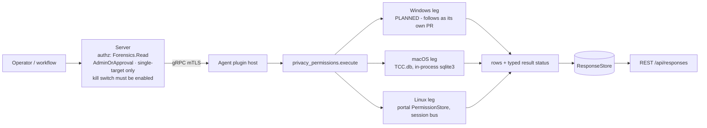

# privacy_permissions

<!-- BEGIN GENERATED: plugin-doc-gen header -->
| | |
|---|---|
| **What it does** | Per-app sensitive-permission grants -- camera, microphone, location, full-disk-access equivalents (read-only) |
| **Version** | 1.0.0 |
| **Kind** | Collector · read-only · gathered (crossplatform.privacy_permissions.permissions) |
| **Platforms** | Windows 🟡 planned · macOS 🟡 constrained · Linux 🟡 constrained |
| **Actions** | `permissions` (definition `crossplatform.privacy_permissions.permissions`) |
| **Security** | securable `Forensics` · operation Read · risk High · dispatch ReadOnly · approval gate AdminOrApproval |
| **Roles** | execute: admin · author: content-author |
<!-- END GENERATED -->

## How it works

One action, `permissions` (`privacy_permissions_plugin.cpp`), reports per-app sensitive-permission grants for four categories -- camera, microphone, location, full-disk-access -- as rows `permissions|<os>|<app_id>|<category>|<state>|<raw>|<last_used_start>|<last_used_stop>` (the leading field is the definition's `row_kind` column). The action takes no parameters. Every leg is rung 1 and an in-process read: no PowerShell and no subprocess on any OS.

- **macOS** reads `TCC.db` in-process (never a `sqlite3` CLI shellout) and never writes. It opens each `TCC.db` read-only once (`O_NOFOLLOW_ANY`) and SQLite reads that descriptor through `/dev/fd/N` with `immutable=1`: no lock, and SQLite opens or creates no `-journal`, `-wal` or `-shm`. The plugin only `lstat()`s those names and refuses a database that has one, is WAL-mode, is not a regular SQLite file of 1 byte to 4 MiB, or changes during the read (inode, size, mtime, ctime and the header change counter are compared before and after), so a concurrent `tccd` commit reads `unreadable` and uncommitted `tccd` writes are invisible. The mount table is read once per run (`getmntinfo(MNT_NOWAIT)`, the kernel's cache, never a call into a remote server) and a path on or under a network-backed mount (`nfs`, `smbfs`, `webdav`, `afpfs`, `autofs` and the rest of the shared deny-list) is refused before any call touches it. It queries the `access` table for the three TCC-governed categories (camera, microphone, full-disk-access) in two kinds of source: the **system** `/Library/Application Support/com.apple.TCC/TCC.db` (rows unqualified) and **each user's own** `~/Library/Application Support/com.apple.TCC/TCC.db` for every real home directly under `/Users` (a directory, not a symlink, owned by uid 500 or above -- the `autoruns` rule), rows qualified `<user>/<app_id>` (the home folder name). Per-user rows are what that user's own, user-writable file says: they do not attest what `tccd` enforces, and system-db (MDM) precedence is not modelled. Camera and microphone grants normally live in the per-user databases (measured on one non-MDM Mac; MDM PPPC entries likely land in the system database). `auth_value` 0 is `denied`, 2 and 3 are `allowed`, and anything else, 1 included, is `prompt_undetermined` with the true value in `raw`. SQLite runs in its defensive, untrusted-schema and cell-size-check modes, and every source is bounded: a 64 KiB schema parse limit, 1024 rows per service, a 1024-byte value limit, 1 MiB retained and 500 ms per source, and 10 s and 16 MiB of output per run (every source and enumeration row is counted at its formatted length, escapes and separators included, and the last fixed `location` row is not; the cap is checked between sources, so the real bound is 16 MiB plus the source that crosses it). The time budgets are enforced by SQLite's progress handler and between services; they start before the file is opened but cannot interrupt `lstat`, `open` or `read` (caveat 3). `location` is administered by `locationd` outside TCC entirely (ADR-3003) and ships as its own explicit `unsupported` row on every collection.
- **Windows** -- PLANNED, follows as its own PR: the `ProfileList` → `ConsentStore` registry walk. Until then this leg reports one whole-source `unsupported` row (`windows:planned` in `raw`) and result status UNAVAILABLE/PARTIAL with `windows:planned` as the provenance, never an empty success.
- **Linux** calls `org.freedesktop.impl.portal.PermissionStore.Lookup` over the agent process's **own** session D-Bus (`sd_bus_open_user`) -- it never reaches another user's session. Each table is decoded on its own terms: a `devices` record (`camera`, `microphone`) is one of `yes`/`no`/`ask`, a `location` record is `[accuracy, timestamp]` where `NONE` is a refusal and `COUNTRY`/`CITY`/`NEIGHBORHOOD`/`STREET`/`EXACT` a grant; any other value is `prompt_undetermined` with the list kept in `raw`; rows are sorted by `app_id`. No session bus or no portal daemon is `unsupported`/`UNAVAILABLE` (provenance `portal:unavailable`), not a failure. The three lookups share one 5-second total deadline; a lookup that runs out of it reads `<category>:timeout`.



## OS capability

<!-- BEGIN GENERATED: plugin-doc-gen capability -->
| Action | Windows | macOS | Linux |
|---|---|---|---|
| `permissions` | 🟡 planned · rung 1 · HKLM ProfileList enumeration, then each real profile's SOFTWARE\\Microsoft\\Windows\\CurrentVersion\\CapabilityAccessManager\\ConsentStore via its loaded HKU\\<SID> hive or an offline NTUSER.DAT mount (RegLoadKeyW, SeBackup/SeRestore), plus the same HKLM ConsentStore path | 🟡 constrained · rung 1 · TCC.db read-only, in-process sqlite3 over one descriptor with an immutable URI (no lock, no -journal/-wal/-shm ever opened or created; a WAL-mode, journal-bearing or changing file is refused, never read): the system /Library/Application Support/com.apple.TCC/TCC.db plus each /Users/<home> (uid >= 500) per-user Library/Application Support/com.apple.TCC/TCC.db | 🟡 constrained · rung 1 · xdg-desktop-portal org.freedesktop.impl.portal.PermissionStore.Lookup over the agent process's own session bus (sd_bus_open_user) |

**Declared limits per leg** (descriptor fallback text, verbatim):

- **`permissions` / Windows** — follows as its own PR
- **`permissions` / macOS** — every TCC.db is TCC-protected: without Full Disk Access each read is denied; camera and microphone grants normally live in the per-user dbs; location is unsupported (locationd, outside TCC)
- **`permissions` / Linux** — never another user's session: a system-service agent has no session bus in every shipped deployment and reports unavailable, which says nothing about interactive users' grants; only portal-mediated grants are visible (an app opening the device directly never appears); full_disk_access is unsupported (no portal equivalent)
<!-- END GENERATED -->

## Privileges and prerequisites

| OS | Runs as | Extra grant needed | Measured | If the read is refused |
|---|---|---|---|---|
| macOS | agent daemon, root today (LaunchDaemon carries no `UserName` key -- `docs/agent-privilege-model.md` TL;DR) | Every `TCC.db` -- the system one and each per-user one -- is TCC-protected regardless of privilege level; a separate Full Disk Access (FDA) grant is needed (how to grant it to the agent is not yet measured) | 2026-09-23 (sample recaptured 2026-09-29), this Mac (`braga`), euid 501 with ambient FDA (NOT the production agent identity): the system db and the per-user db both read (per-user microphone grants visible). The same run with both TCC directories read-denied (a `sandbox-exec` deny profile, standing in for a non-FDA identity) reported both sources `denied`, `PERMISSION_DENIED`/`PARTIAL`. Not measured: the production root LaunchDaemon's own outcome, how to grant it Full Disk Access, and the verbatim `sqlite3_errmsg` a real TCC refusal produces | A refused `lstat` or `open` (`EPERM`/`EACCES`), `SQLITE_AUTH`/`SQLITE_PERM`, or `SQLITE_CANTOPEN` whose underlying syscall failed `EPERM`/`EACCES` on a file that is there, reports that source's whole-source row `denied` (`tcc_db:access_denied`, `<user>:tcc_db:access_denied`, `...:open_failed:errno_<n>`, `...:open_failed:<msg>`), `PERMISSION_DENIED`/`PARTIAL`. An agent without FDA sees this for every source |
| Windows | PLANNED -- follows as its own PR | -- | -- | -- |
| Linux | agent daemon, default (a service user with no session bus) | None -- the portal call is an ordinary session-bus D-Bus method call, which the agent's own session must offer | 2026-09-23, Debian 13 container, `xdg-desktop-portal` 1.20.3's permission store seeded with test records: the `devices` and `location` Lookups decoded as above. Not measured on a desktop user's real session | A refused session-bus socket (`session_bus:access_denied`) or an `AccessDenied`-shaped D-Bus error (`<category>:access_denied`, on that category's own row) reports `denied`, `PERMISSION_DENIED`/`PARTIAL`; a malformed reply reports `unreadable` with `<category>:shape` |

Binaries/subprocesses: none -- every leg is an in-process read (SQLite, the Windows registry API, sd-bus). Network: the Linux leg's D-Bus call is local-machine IPC only, never a network socket.

## Data contract

### Inputs

<!-- BEGIN GENERATED: plugin-doc-gen inputs -->
The action takes no parameters.
<!-- END GENERATED -->

### Outputs

One row per app per category, led by `row_kind` `permissions` (`constrained` only on the one internal-error row, `constrained|<os>|-|-|unreadable|internal_error|-|-`, which keeps the same field count). Every category of every source is a row -- its decoded grants, `absent` when the source cleanly holds none, `unsupported` when no mechanism reaches it (macOS `location`, Linux `full_disk_access`), or a failure row -- or is covered by a whole-source row (`category` `-`) for a source that could not be read at all, or that holds no file (a macOS user with no per-user `TCC.db`, `absent`). `denied` covers two facts, kept as one state: a decoded refusal, whose `raw` is the native value (`Deny`, `0`, `no`, `NONE,<timestamp>`), and a refused read, whose `raw` is a `<subject>:<cause>` failure token (the agent-log provenance carries it too, except Windows per-app failures, which reach it as the coarse `<source>:<category>:<cause>`; the row sanitizer writes a `\` in a token as `/`) and whose `category` is `-` when the whole source was refused; `unreadable` always carries a token. `app_id` `-` means no specific app (on Windows, the capability's own toggle; `NonPackaged` is the desktop-apps toggle); a row from a per-user source is qualified `<user>/<app_id>` (each Windows profile, each macOS per-user `TCC.db`); an unqualified `app_id` comes from a machine-wide source (the macOS system `TCC.db`, the Windows HKLM mirror) or, on Linux, from the agent's own session's portal store -- that one session's grants, never machine-wide. On Windows, `last_used_start`/`last_used_stop` read `unreadable` (plus a `...:last_used_start_<cause>` token in the agent log) when the value exists but is not an 8-byte `REG_QWORD` or could not be read.

<!-- BEGIN GENERATED: plugin-doc-gen outputs -->
**`crossplatform.privacy_permissions.permissions` — `row_kind|os|app_id|category|state|raw|last_used_start|last_used_stop`**

| Field | Type | Values | Available | Example | Description |
|---|---|---|---|---|---|
| `row_kind` | string | `permissions` `constrained` | Windows, Linux, macOS | `permissions` | Row family: `permissions` (every data row) or `constrained` (the one row the plugin writes when it fails internally: `raw` is `internal_error`, the result is CONSTRAINED). |
| `os` | string | `macos` `windows` `linux` | Windows, Linux, macOS | `macos` | The reporting OS. |
| `app_id` | string | - | Windows, Linux, macOS | `com.example.App` | Per-app identifier: a TCC client id (bundle id or path, macOS), an executable path or Package Family Name (Windows), a portal-reported app id (Linux). "-" means no specific app: a Windows capability-level toggle, a per-category `absent`/ `unsupported` row, or a failure row. On Windows `NonPackaged` is the capability's "let desktop apps access" toggle; a desktop app's own row reads `absent` (it stores no decision) and is governed by that toggle. A row read from a PER-USER source is qualified with that user's name -- `<user>/<app_id>` or `<user>/-` on the wire (the row sanitizer writes the separator `\` as `/`, as it does inside every path): each Windows profile's ConsentStore and each macOS per-user TCC.db. An unqualified app_id comes from a machine-wide source (the macOS system TCC.db, the Windows HKLM ConsentStore mirror) or, on Linux, from the portal store of the agent's OWN session -- that one session's grants, never machine-wide. |
| `category` | string | `camera` `microphone` `location` `full_disk_access` `-` | Windows, Linux, macOS | `camera` | The fixed cross-OS permission category. "-" only on a whole-source row -- one row standing for every category of a source that could not be read at all (a TCC.db, a Windows profile hive, ConsentStore root or ProfileList discovery, the session bus/portal, or what a Windows or macOS run left unread once a budget or time limit was spent), or that holds no file (a macOS user with no per-user TCC.db). |
| `state` | string | `allowed` `denied` `prompt_undetermined` `absent` `unreadable` `unsupported` | Windows, Linux, macOS | `allowed` | allowed/denied: a real, decoded grant. `denied` also covers a READ that was refused -- one state for both, told apart by `raw`: a decoded refusal carries the native value (Deny, 0, no, NONE,<timestamp>), a refused read a `<subject>:<cause>` token (and category "-" when the whole source was refused). prompt_undetermined: the mechanism reported a value this plugin does not map to allowed/denied (never guessed) -- a mapped Prompt/ask/macOS auth_value 1 and an unmapped value alike; `raw` keeps the true value. absent: no record for this app+category (or this source) -- not a failure; a Windows NonPackaged app row also reads `absent`, WITH its last-used times: the app stores no decision of its own and its state follows the NonPackaged toggle row. unreadable: the read itself failed; `raw` names why. unsupported: no mechanism reaches this category on this OS/host (macOS location; Linux full_disk_access; Linux with no session bus or portal daemon). |
| `raw` | string | - | Windows, Linux, macOS | `2` | The mechanism-native value behind `state` (a TCC auth_value integer: 0 denied, 2 and 3 allowed, anything else prompt_undetermined; a ConsentStore Value string; a joined portal permission list); on a failure row (`denied` from a refused read, or `unreadable`) the failure token, with `\` written `/` (the agent-log provenance carries it too, except a Windows per-app failure, which reaches it as the coarse `<source>:<category>:<cause>`); "-" when nothing meaningful beyond the state itself. |
| `last_used_start` | string | - | Windows | `1700000000000` | Windows ConsentStore LastUsedTimeStart, epoch milliseconds; "-" when never set or on any other OS; `unreadable` when the value exists but is not an 8-byte REG_QWORD or could not be read (a `...:last_used_start_<cause>` token names it). |
| `last_used_stop` | string | - | Windows | `1700000100000` | Windows ConsentStore LastUsedTimeStop, epoch milliseconds; "-" when never set (a stored 0 also reads "-": conventionally in use now, unmeasured) or on any other OS; `unreadable` when the value exists but is not an 8-byte REG_QWORD or could not be read (a `...:last_used_stop_<cause>` token names it). |
<!-- END GENERATED -->

### Result status

The typed status is recorded with the result (and appears unlabelled in agent-transition events) but is not shown as a label on REST, MCP or the dashboard, so read each row's `state` and `raw`; completeness and provenance reach only the agent log.

| Status | Completeness | Provenance | When |
|---|---|---|---|
| `OK` | `FULL` | — | No read was refused and no failure token exists: every category was read or is `absent`/`unsupported`. Completeness is in the rows: any `unreadable`/`denied` row, or a category `-` row, means a source was not fully read. A host with no grants recorded for any mapped category still reports `OK`. |
| `UNAVAILABLE` | `FULL` | `portal:unavailable` | Linux only: the agent's own account has no session bus, or no portal backend answered any lookup (`ServiceUnknown` on every table). One whole-source row, state `unsupported` (`app_id` and `category` both `-`). Says nothing about interactive users' grants. |
| `UNAVAILABLE` | `PARTIAL` | `windows:planned` | Windows (PLANNED leg): every dispatch, until the leg ships. One whole-source row, state `unsupported` (`app_id` and `category` both `-`). PARTIAL, not FULL -- a planned leg has not looked at all, unlike Linux's own no-session-bus case above; it bypasses the shared status selector for exactly this reason. |
| `CONSTRAINED` | `PARTIAL` | see below | A read failed for a reason other than a refusal; each failed read is its own `unreadable` row naming the token (bar the two agent-log-only cases below). |
| `PERMISSION_DENIED` | `PARTIAL` | see below | At least one read was refused -- a TCC-protected `TCC.db` without Full Disk Access, a refused session-bus socket or a portal `AccessDenied` on Linux. Wins over `CONSTRAINED` when both occur. |

Every token is `<subject>:<cause>`; on a failure row it is also the row's `raw`. The complete set this plugin emits today, by leg, with what it means and what to do:

- **macOS, whole source** -- `tcc_db:<cause>` (system db) or `<user>:tcc_db:<cause>` (per-user db). `denied` (the agent lacks Full Disk Access; retrying is futile; how to grant it is unmeasured): `access_denied`, `open_failed:errno_<n>` (`EPERM`/`EACCES`), `open_failed:<sqlite msg>`, `prepare_failed:<sqlite msg>` (`SQLITE_AUTH`/`PERM`, or `SQLITE_CANTOPEN` with an `EPERM`/`EACCES` syscall, on a file that is there). `unreadable`, `tccd` mid-write: `changed_during_read`, `sidecar_present` -- retry twice, 30-60 s apart, keyed on the `raw` suffix (no typed status reaches REST or MCP); if it repeats on 3 consecutive runs, suspect a WAL-mode database or a stale sidecar left by a crashed `tccd`: never delete a TCC sidecar (it corrupts the database), reboot so `tccd` recovers it. `unreadable`, out of time (the 500 ms source or 10 s run budget ran out): `timeout` -- a `timeout` that repeats is not retryable, the database is oversized or hostile. `unreadable`, refused file, inspect it: `wal_mode`, `not_sqlite`, `size_out_of_range`, `not_regular`, `open_failed:symlink`. `unreadable`, OS error, the errno or message says which: `missing` (system db only), `lstat_errno_<n>`, `read_failed` (`fstat` or `pread` on the opened file failed), `hardening_failed` (SQLite's untrusted-database settings could not be applied, so the source is not read), `open_failed:errno_<n>`, `open_failed:<sqlite msg>`, `prepare_failed:<sqlite msg>`, `query_only_failed:<sqlite msg>` (`<sqlite msg>` is cut to 200 bytes; control characters become spaces and `|` and `\` become `/`).
- **macOS, per category** (`unreadable`; the category is incomplete, rows read before it are kept) -- `<source>:<category>:row_cap` (over 1024 rows: an oversized database), `:byte_cap` (over 1 MiB retained for the source), `:timeout`, `:value_oversized` (a value over the 1024-byte limit: a hostile or corrupt database), `:query_bind_failed`, `:query_step_failed`, `:auth_value_unreadable`, where `<source>` is `tcc_db` or `<user>:tcc_db`.
- **macOS, home enumeration** -- `users:open_errno_<n>` and `<user>:home_stat_errno_<n>` (`denied` for EPERM/EACCES, else `unreadable`); `users:fdopendir_errno_<n>`, `users:truncated`, `users:readdir_error` (`unreadable`); `users:network_mount` and `<user>:network_mount` (`unreadable`: the users directory, or that home, is a network-backed mount point and was not touched); `mounts:getmntinfo_failed` (`unreadable`: the mount table could not be read, so the sources were read without the network-mount guard); a home with no row was not read. A source whose own path is under a network mount reads `<source>:network_mount` (`unreadable`). `collection:budget_exceeded` (`unreadable`): the run-wide 16 MiB output cap (checked between sources) stopped the run, so later users' sources were not read.
- **Windows** -- PLANNED, follows as its own PR. Until then, every dispatch reports one whole-source row `unsupported`, `UNAVAILABLE`/`PARTIAL`, provenance `windows:planned`.
- **Linux** -- `session_bus:access_denied` (`denied`), `session_bus:open_errno_<n>` (`unreadable`); `<category>:access_denied` (`denied`); `<category>:lookup_failed`, `<category>:timeout` (the shared deadline ran out), `<category>:shape`, `<category>:entry_shape`, `<category>:service_unknown` (some lookups reached no portal), `<app_id>:<category>:empty_permissions` (the portal returned an app with no permission value -- no decision, never `denied`), `portal:not_built` (built without libsystemd) (`unreadable`).
- **All** -- `internal_error` (the `constrained` row).

### Where the data goes

- **Instruction result.** Rows go to the standard `ResponseStore`, kept 90 days (`--response-retention-days`, default 90), and are served over `GET /api/responses` (legacy), `GET /api/v1/responses/{id}` and the equivalent MCP result-poll tools.
- **Not consumed by** daily-sync, TAR, DEX, or metrics.
- **Sensitivity.** Names, per app on a specific machine, whether that app currently holds live audio/video/location/filesystem-access capability. Rows carry the profile or home folder name (normally the local account name) as the `<user>/` qualifier on macOS and Windows rows -- never a SID or token, though nothing filters an e-mail-shaped Windows profile folder name -- app ids can embed profile paths, and Windows last-used times are usage-class behavioural data; user names in the samples are replaced with `jsmith`. Dispatch is gated `Forensics:Read` + `AdminOrApproval`, but stored rows are readable by any `Response:Read` holder (Administrator, Operator, Viewer, PlatformEngineer and ITServiceOwner by default; any authenticated session while RBAC is off) -- audited as `response.read` (REST v1 `/responses/{id}`, `/aggregate`, `/export`), `execution.detail.fetch` (`/executions/{id}/responses`) and `mcp.query_responses`; the legacy `/api/responses` routes and the dashboard results view write only a scope-drop `denied` row, never a success row. There is no per-user erasure path.
- **Default-off, single-target.** No dispatch succeeds until an operator enables the plugin with `PUT /api/v1/plugin-config/privacy_permissions/kill-switch {"enabled":true}` (`PluginConfig:Write`, audited as `plugin_config.kill_switch.set`; the MCP twin is `set_plugin_kill_switch`). Dispatch needs `Forensics:Read` + `AdminOrApproval` (Administrator by default; a non-admin needs a delegated `Forensics:Read` grant plus an approval) and names exactly one device. While it is off, REST `/api/command` answers "permission denied: Forensics:Read" even to an Administrator, the dashboard console says "No agents connected", MCP returns an "emergency stop" message, and instruction execute answers 503 "no agents reached ... concurrency claim" (misleading; check the switch first). Disabling stops new dispatches; a delayed or staggered command already sent still runs (up to 10 minutes).
- **Siblings:** `execution_artifacts` (the other Forensics-class Windows-evidence plugin).

## Sample output

<!-- BEGIN GENERATED: plugin-doc-gen samples -->
**macOS** — captured: macos macOS 26.6.2 arm64 · bare-metal · 2026-09-29 · euid 501 (ambient FDA, NOT the production agent identity -- see leg banner; account names replaced with jsmith) · leg-hash 08943043c455

```
== action=permissions
permissions|macos|-|camera|absent|-|-|-
permissions|macos|-|microphone|absent|-|-|-
permissions|macos|/Library/PrivilegedHelperTools/com.microsoft.autoupdate.helper|full_disk_access|denied|0|-|-
permissions|macos|/usr/libexec/sshd-keygen-wrapper|full_disk_access|allowed|2|-|-
permissions|macos|com.microsoft.VSCode|full_disk_access|allowed|2|-|-
permissions|macos|com.nordvpn.macos|full_disk_access|denied|0|-|-
permissions|macos|com.spotify.client|full_disk_access|denied|0|-|-
permissions|macos|net.whatsapp.WhatsApp|full_disk_access|denied|0|-|-
permissions|macos|jsmith/com.microsoft.teams2|camera|allowed|2|-|-
permissions|macos|jsmith/org.whispersystems.signal-desktop|camera|allowed|2|-|-
permissions|macos|jsmith/com.microsoft.teams2|microphone|allowed|2|-|-
permissions|macos|jsmith/org.whispersystems.signal-desktop|microphone|allowed|2|-|-
… 12 of 14 rows shown
[result_status] OK / FULL
```

**Linux** — captured: linux Debian GNU/Linux 13 (trixie) aarch64 · container · 2026-09-25 · euid 0 · leg-hash 08943043c455

```
== action=permissions
permissions|linux|org.example.CamApp|camera|allowed|yes|-|-
permissions|linux|org.example.MicApp|microphone|denied|no|-|-
permissions|linux|org.example.MapApp|location|allowed|EXACT,0|-|-
permissions|linux|org.example.NoLocApp|location|denied|NONE,0|-|-
permissions|linux|-|full_disk_access|unsupported|-|-|-
[result_status] OK / FULL
```
<!-- END GENERATED -->

## Caveats and known gaps

1. **Why this plugin exists, and why it is off by default.** Gives an investigator forensic visibility into which apps currently hold camera/microphone/location/full-disk-access grants on an endpoint -- useful when following up a suspected compromise or a policy violation. No specific customer or compliance-framework request drove it; it was built ahead of demand, matching the other Forensics-tier plugins' cadence. Because it reads sensitive per-app/per-user permission state, it ships default-off (`Forensics:Read` + `AdminOrApproval`) like every other Forensics-class plugin, and stays off until an operator explicitly enables it. Reads one machine per request; Linux reports only the agent's own session, normally `unavailable` under the shipped service.
2. **macOS is unmeasured under the production identity.** Every `TCC.db` is TCC-protected, so the root LaunchDaemon without Full Disk Access is expected to read every source `denied`; neither that identity's real outcome, how to grant it Full Disk Access, nor the verbatim `sqlite3_errmsg` of a real TCC refusal has been measured.
3. **macOS reads an immutable snapshot of files the user owns, and coverage is `/Users` only.** Per-user rows are what that user's own, user-writable file says, so they do not attest what `tccd` enforces and system-db (MDM) precedence is not modelled; a relocated or network home is not read, and reaching the files is not time-bounded: a network-backed mount is refused up front from the mount table, but a stacked filesystem over one reports its own local type, a mount that appears after the snapshot is not seen, and every `lstat`, `open` and `read` on a path treated as local runs outside the time bound, so a device that stops answering can block the run with every row lost, since rows are buffered to the end.
4. **Windows is planned, not yet implemented.** The leg follows in its own PR; until then every dispatch on Windows reports one whole-source `unsupported`/`UNAVAILABLE` row with `windows:planned` in `raw`, never an empty success and never claimed working.
5. **Linux reads only the agent's own session, and the portal reply has no size bound (#5057).** Each user's portal store lives in that user's session, so in every shipped deployment (a service user, no session bus) the leg reports `unsupported`/`UNAVAILABLE`, which says nothing about interactive users; data appears only inside a desktop session and only for portal-mediated grants -- a native app opening `/dev/video0` never appears, so `absent` does not mean no access -- and `full_disk_access` has no portal equivalent and reports `unsupported`. Separately, the `PermissionStore.Lookup` reply itself is decoded with no row/byte/entry cap, unlike `runtimes`' `WalkLimits`; mitigated by default-off + `AdminOrApproval` + single-target + a 5-second wall-clock call budget, tracked not yet fixed in issue #5057.

## Source and tests

<!-- BEGIN GENERATED: plugin-doc-gen source -->
- Plugin: `agents/plugins/privacy_permissions/src/privacy_permissions_legs.hpp` · `agents/plugins/privacy_permissions/src/privacy_permissions_linux.cpp` · `agents/plugins/privacy_permissions/src/privacy_permissions_linux_parsers.hpp` · `agents/plugins/privacy_permissions/src/privacy_permissions_macos.cpp` · `agents/plugins/privacy_permissions/src/privacy_permissions_macos_parsers.hpp` · `agents/plugins/privacy_permissions/src/privacy_permissions_parsers.hpp` · `agents/plugins/privacy_permissions/src/privacy_permissions_plugin.cpp` · `agents/plugins/privacy_permissions/src/privacy_permissions_win.cpp`
- Definitions: `content/definitions/privacy_permissions.yaml`
- Capability rows: `server/core/src/capability_decls/plugin_action_catalogue_privacy_permissions.hpp`
- Tests: `tests/unit/test_privacy_permissions_local_dispatcher.cpp` · `tests/unit/test_privacy_permissions_macos_internals.cpp` · `tests/unit/test_privacy_permissions_parsers.cpp`
- Privilege row: `docs/agent-privilege-model.md`
- Changelog: `changelog.d/2026-09-29-privacy_permissions-macos-leg.added.md`
<!-- END GENERATED -->
