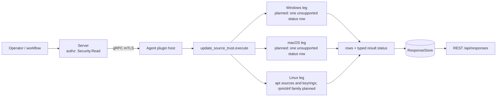

# update_source_trust

<!-- BEGIN GENERATED: plugin-doc-gen header -->
| | |
|---|---|
| **What it does** | Package and update-source trust posture (facts only) |
| **Version** | 1.0.0 |
| **Kind** | Collector · read-only · gathered (crossplatform.security.update_source_trust) |
| **Platforms** | Windows 🟡 planned · macOS 🟡 planned · Linux ✅ |
| **Actions** | `sources` (definition `crossplatform.security.update_source_trust`) |
| **Security** | securable `Security` · operation Read · risk Low · dispatch ReadOnly · approval gate None |
| **Roles** | execute: endpoint-admin, endpoint-operator, security-admin · author: content-author |
<!-- END GENERATED -->

## How it works

`sources` reports facts about how the device's package and update sources are configured to trust their signing authorities. It reads local configuration and nothing else: no subprocess, no network fetch, no write. The first row is always a `status` row saying whether the read was complete; the data rows follow, one per source. It reports what is configured and leaves any judgement, and any enforcement, to the consumer and to the sibling posture plugins.

On Linux, apt sources are read from `/etc/apt/sources.list` and `/etc/apt/sources.list.d/` in both the one-line and the deb822 format, with the `signed-by`, `trusted` and `allow-insecure` settings surfaced. The apt keyring files under `/etc/apt/trusted.gpg`, `/etc/apt/trusted.gpg.d/` and `/etc/apt/keyrings/` are listed with their format and size (key material is never emitted). The yum/dnf `.repo` family follows as its own PR: until then the leg only lists `/etc/yum.repos.d` (names, no `.repo` file is opened) and, when that directory has entries, reports `CONSTRAINED` with `linux:rpm_repo:planned`, so an rpm host never reads as having no sources. The macOS Software Update read and the Windows leg are planned and each answers with one `unsupported` status row until it lands. Files are opened without following symlinks and read with a 1 MiB cap.



## OS capability

<!-- BEGIN GENERATED: plugin-doc-gen capability -->
| Action | Windows | macOS | Linux |
|---|---|---|---|
| `sources` | 🟡 planned · rung 1 · HKLM\\SOFTWARE\\Policies\\Microsoft\\Windows\\WindowsUpdate{,\\AU} registry values | 🟡 planned · rung 1 · CFPropertyListCreateWithData over /Library/Preferences and /Library/Managed Preferences com.apple.SoftwareUpdate.plist | ✅ supported · rung 1 · /etc/apt/sources.list{,.d/*} (one-line + deb822), /etc/apt/trusted.gpg{,.d/*} and /etc/apt/keyrings/* config file reads |

**Declared limits per leg** (descriptor fallback text, verbatim):

- **`sources` / Windows** — follows as its own PR
- **`sources` / macOS** — follows as its own PR
- **`sources` / Linux** — rpm/dnf /etc/yum.repos.d/*.repo family follows as its own PR; a host with that directory reports constrained linux:rpm_repo:planned
<!-- END GENERATED -->

## Privileges and prerequisites

| OS | Runs as | Extra grant needed | Measured | If the read is refused |
|---|---|---|---|---|
| Windows | n/a — the leg is planned and reads nothing | n/a | n/a | n/a — the placeholder reports `unsupported` with `windows:planned` |
| macOS | n/a — the leg is planned and reads nothing | n/a | n/a | n/a — the placeholder reports `unsupported` with `macos:planned` |
| Linux | agent daemon, dedicated unprivileged account (`yuzu`), never root by design (`docs/agent-privilege-model.md`) | None to read | Not yet measured; the post-integration capture records it (`docs/samples/linux.txt`) | `CONSTRAINED` / partial with a `linux:apt_sources:<detail>` or `linux:apt_keyring:<detail>` token (or `linux:rpm_repo:<detail>` when the `/etc/yum.repos.d` listing itself is refused); the unreadable source is absent from the rows, never reported as unsigned or absent |

No external binaries, no subprocesses, no shell-out and no network use: the Linux leg is an in-process, bounded read of local files, and the macOS and Windows legs read nothing.

## Data contract

### Inputs

<!-- BEGIN GENERATED: plugin-doc-gen inputs -->
The action takes no parameters.
<!-- END GENERATED -->

### Outputs

Every row is pipe-delimited; field 0 is the row kind and the first row is always `status|sources|<supported\|constrained\|unsupported>|<reason or ->`. The kinds are `apt_source` and `apt_keyring` (the `rpm_repo`, `macos_swu` and `wsus` kinds are planned for the follow-up legs and are not emitted today); every row of a kind has the same field count, and `-` is an absent value. Booleans use one four-value vocabulary: `yes`, `no`, `unset` (the key is absent) and `unmodelled` (the key is present with a value the plugin does not recognise). A host that has no apt configuration reports zero rows and stays `supported`: an absent thing is not a failure (the deferred rpm/dnf family is the exception, see Result status). Free text is escaped for the server's pipe grammar (`safe_output_field`, lossy on backslash by design) and URL userinfo (`user:pass@`) is redacted. `update_source_trust` is not in the server's key/value plugin set, so rows are decoded as pipe-separated fields, not as `key|rest`. The columns below are the widest shapes; narrower shapes use a prefix of them.

<!-- BEGIN GENERATED: plugin-doc-gen outputs -->
**`crossplatform.security.update_source_trust` — `row_kind|field_1|field_2|field_3|field_4|field_5|field_6|field_7|field_8|field_9|field_10`**

| Field | Type | Values | Available | Example | Description |
|---|---|---|---|---|---|
| `row_kind` | string | `status` `apt_source` `apt_keyring` | Windows, Linux, macOS | `apt_source` | Row shape discriminator (field 0). Values: status, apt_source, apt_keyring. The rpm_repo, macos_swu and wsus shapes are documented in the field descriptions below for the planned rpm/dnf, macOS and Windows legs and are not emitted today. |
| `field_1` | string | - | Windows, Linux, macOS | `/etc/apt/sources.list.d/debian.sources` | status: the literal "sources". apt_source: the logical absolute path of the source file. apt_keyring: the keyring file path. Planned, not emitted today: rpm_repo: the logical absolute path of the .repo file. macos_swu: scope, local or managed. |
| `field_2` | string | - | Windows, Linux, macOS | `deb822` | status: supported, constrained or unsupported (Windows and macOS report unsupported until their legs land). apt_source: format, one_line or deb822. apt_keyring: scope (legacy_trusted_gpg, trusted_gpg_d or etc_apt_keyrings). Planned, not emitted today: rpm_repo: repo id. macos_swu: catalog URL, "-" when the plist sets none, or unmodelled for a value of the wrong type. |
| `field_3` | string | - | Windows, Linux, macOS | `deb` | status: reason token(s) for a constrained or unsupported read, "-" when complete; a token has the form <os>:<source>:<detail> (windows:planned on Windows, macos:planned on macOS, linux:rpm_repo:planned on a Linux host whose /etc/yum.repos.d has entries). apt_source: source types (deb, deb-src or unmodelled). apt_keyring: key format (armored, binary, empty or unmodelled). Planned, not emitted today: rpm_repo: repository name. macos_swu: auto_check. |
| `field_4` | string | - | Linux, macOS | `https://deb.debian.org/debian` | apt_source: URIs, userinfo (user:pass@) redacted. apt_keyring: size in bytes. Planned, not emitted today: rpm_repo: enabled. macos_swu: auto_download. Not used by status. Values for booleans: yes, no, unset, unmodelled. |
| `field_5` | string | - | Linux, macOS | `bookworm` | apt_source: suites. Planned, not emitted today: rpm_repo: gpgcheck (yes, no, unset, unmodelled; unset means the .repo file does not say, not that the effective value is off). macos_swu: auto_install_macos. |
| `field_6` | string | - | Linux, macOS | `main` | apt_source: components. Planned, not emitted today: rpm_repo: repo_gpgcheck. macos_swu: config_data_install. |
| `field_7` | string | - | Linux, macOS | `/usr/share/keyrings/debian-archive-keyring.gpg` | apt_source: signed_by, the Signed-By value (paths and/or fingerprints), the literal inline_key when a deb822 Signed-By embeds a key block (key material is never emitted), or "-" when absent (apt then uses its global trusted keyrings). Planned, not emitted today: rpm_repo: gpgkey URL(s). macos_swu: critical_update_install. |
| `field_8` | string | - | Linux, macOS | `unset` | apt_source: trusted (yes, no, unset, unmodelled; yes disables signature checking for the source). Planned, not emitted today: rpm_repo: baseurl. macos_swu: allow_prerelease. |
| `field_9` | string | - | Linux | `unset` | apt_source: allow_insecure (yes, no, unset, unmodelled). Planned, not emitted today: rpm_repo: mirror (mirrorlist or metalink) URL. |
| `field_10` | string | - | Linux | `yes` | apt_source: enabled (yes, no, unmodelled; deb822 defaults to enabled). Planned, not emitted today: rpm_repo: sslverify (yes, no, unset, unmodelled). |
<!-- END GENERATED -->

### Result status

`sources` sets `OK`/`FULL` when every read completed, including a host with no sources at all. Any read that failed for a reason other than the file being absent (permission, symlink, oversize, short read, listing error, entry cap, an entry that would not parse) makes the whole result `CONSTRAINED`/`PARTIAL` with the failure tokens as the reason, and the same tokens appear in the leading `status` row. A Linux host whose `/etc/yum.repos.d` has entries is `CONSTRAINED`/`PARTIAL` with `linux:rpm_repo:planned`: the rpm/dnf family is not read yet, and a skipped family never reads as an empty one. Windows and macOS report `UNAVAILABLE` until their legs land. No exception crosses the plugin boundary: a leg that throws is reported as `UNAVAILABLE` with an exception token.

| Status | Completeness | Provenance | When |
|---|---|---|---|
| `OK` | full | (empty) | Linux: every read completed, populated or genuinely empty (no `/etc/yum.repos.d` entries) |
| `CONSTRAINED` | partial | `linux:apt_sources:<detail>` / `linux:apt_keyring:<detail>` / `linux:rpm_repo:<detail>`, with `<detail>` one of `permission_denied`, `symlink_refused`, `not_a_directory`, `not_regular`, `io_error`, `open_failed`, `read_failed`, `dir_open_failed`, `oversized`, `short_read`, `enumeration_error`, `entry_cap` or `unparsed_entry` (apt only) | a source exists but could not be read completely or decoded; the rows that were read are still emitted |
| `CONSTRAINED` | partial | `linux:rpm_repo:planned` | `/etc/yum.repos.d` has entries and the rpm/dnf `.repo` family is planned, not yet read; the apt rows that were read are still emitted |
| `UNAVAILABLE` | unknown | `windows:planned` | Windows: the leg is planned; one `status\|sources\|unsupported\|windows:planned` row |
| `UNAVAILABLE` | unknown | `macos:planned` | macOS: the leg is planned; one `status\|sources\|unsupported\|macos:planned` row |
| `UNAVAILABLE` | unknown | `windows:leg:exception` / `linux:leg:exception` / `macos:leg:exception` | a leg threw; reported instead of unwinding across the plugin boundary |

### Where the data goes

- **Instruction result.** Rows travel over the agent's mTLS gRPC channel as the command response and land in the ResponseStore, queryable at `/api/responses/{id}`. `sources` is also a gathered definition (`crossplatform.security.update_source_trust`, 300s TTL).
- **Not consumed by** daily-sync, TAR, DEX, or metrics.
- **Sensitivity.** Rows name the repositories a device installs software from (URIs, key paths), which discloses part of its software supply chain. URL userinfo is redacted; a secret carried in a URL query string cannot be recognised and is emitted as written. Key material is never emitted, only key file paths, formats and sizes. No row carries a username.
- **Siblings:** `windows_updates` (patch compliance and reachability of update sources, not their trust) and `installed_apps` (what is installed, not where it came from).

## Sample output

<!-- BEGIN GENERATED: plugin-doc-gen samples -->
**macOS** — captured: macos macOS 26.6.2 arm64 · bare-metal · 2026-09-21 · euid 501 · leg-hash 4901149d2e67

```
== action=sources
status|sources|unsupported|macos:planned
[result_status] UNAVAILABLE / UNKNOWN / macos:planned
```

**Linux** — captured: linux Debian GNU/Linux 13 (trixie) aarch64 · container · 2026-09-21 · euid 0 · leg-hash 4901149d2e67

```
== action=sources
status|sources|supported|-
apt_source|/etc/apt/sources.list.d/debian.sources|deb822|deb|http://deb.debian.org/debian|trixie trixie-updates|main|/usr/share/keyrings/debian-archive-keyring.pgp|unset|unset|yes
apt_source|/etc/apt/sources.list.d/debian.sources|deb822|deb|http://deb.debian.org/debian-security|trixie-security|main|/usr/share/keyrings/debian-archive-keyring.pgp|unset|unset|yes
apt_keyring|/etc/apt/trusted.gpg.d/debian-archive-bookworm-automatic.asc|trusted_gpg_d|armored|11861
apt_keyring|/etc/apt/trusted.gpg.d/debian-archive-bookworm-security-automatic.asc|trusted_gpg_d|armored|11873
apt_keyring|/etc/apt/trusted.gpg.d/debian-archive-bookworm-stable.asc|trusted_gpg_d|armored|461
apt_keyring|/etc/apt/trusted.gpg.d/debian-archive-bullseye-automatic.asc|trusted_gpg_d|armored|11861
apt_keyring|/etc/apt/trusted.gpg.d/debian-archive-bullseye-security-automatic.asc|trusted_gpg_d|armored|11873
apt_keyring|/etc/apt/trusted.gpg.d/debian-archive-bullseye-stable.asc|trusted_gpg_d|armored|3403
apt_keyring|/etc/apt/trusted.gpg.d/debian-archive-trixie-automatic.asc|trusted_gpg_d|armored|11861
apt_keyring|/etc/apt/trusted.gpg.d/debian-archive-trixie-security-automatic.asc|trusted_gpg_d|armored|11873
apt_keyring|/etc/apt/trusted.gpg.d/debian-archive-trixie-stable.asc|trusted_gpg_d|armored|1384
[result_status] OK / FULL
```
<!-- END GENERATED -->

## Caveats and known gaps

1. **No documented customer driver.** Zero documented driver: `docs/capability-map.md` section 8.8 "Patch Connectivity Testing" tests reachability to update sources, never their trust or authenticity, and every "supply chain" mention in the SOC 2 doc (Workstream C) is about Yuzu's own build and release pipeline, never a customer endpoint's OS or package update-source configuration. Pure capability-gap reasoning.
2. **Facts only.** The plugin is read-only and reports how sources are configured; an unsigned or rogue source is a row, not a verdict. It does not enforce, fetch, verify a signature or resolve a key, and enforcement posture belongs to the sibling posture plugins.
3. **rpm/dnf family planned.** The yum/dnf `.repo` read (`gpgcheck`, `repo_gpgcheck`, `gpgkey`, `sslverify`) follows as its own PR. Until then a Linux host whose `/etc/yum.repos.d` has entries reports `CONSTRAINED` with `linux:rpm_repo:planned` and no `rpm_repo` rows, so it never reads as having no sources; a host without that directory (Debian, Ubuntu) is unaffected and stays `supported`.
4. **macOS and Windows legs planned.** The macOS Software Update policy read (the local and the MDM-managed `com.apple.SoftwareUpdate.plist`, including its Managed Preferences read) and the Windows WSUS and Automatic Updates policy read under `HKLM\SOFTWARE\Policies\Microsoft\Windows\WindowsUpdate` each follow as their own PR; until then each reports one `unsupported` status row. When the Windows leg lands, a host with no WSUS policy will report `policy_configured=no` as a fact, distinct from `constrained`.
5. **Known limits.** Keys referenced by an apt `Signed-By` are reported by path, not resolved or fingerprinted, and `/usr/share/keyrings` is not inventoried.

## Source and tests

<!-- BEGIN GENERATED: plugin-doc-gen source -->
- Plugin: `agents/plugins/update_source_trust/src/update_source_trust_legs.hpp` · `agents/plugins/update_source_trust/src/update_source_trust_linux.cpp` · `agents/plugins/update_source_trust/src/update_source_trust_linux_parsers.hpp` · `agents/plugins/update_source_trust/src/update_source_trust_macos.cpp` · `agents/plugins/update_source_trust/src/update_source_trust_parsers.hpp` · `agents/plugins/update_source_trust/src/update_source_trust_plugin.cpp` · `agents/plugins/update_source_trust/src/update_source_trust_win.cpp`
- Definitions: `content/definitions/update_source_trust.yaml`
- Capability rows: `server/core/src/capability_decls/plugin_action_catalogue_update_source_trust.hpp`
- Tests: `tests/unit/test_update_source_trust_linux_parsers.cpp` · `tests/unit/test_update_source_trust_local_dispatcher.cpp` · `tests/unit/test_update_source_trust_parsers.cpp`
- Privilege row: `docs/agent-privilege-model.md`
<!-- END GENERATED -->
