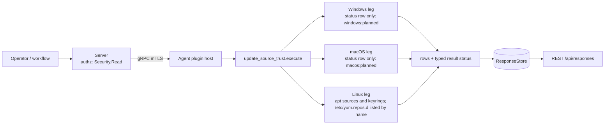

# update_source_trust

<!-- BEGIN GENERATED: plugin-doc-gen header -->
| | |
|---|---|
| **What it does** | Package and update-source trust posture (facts only) |
| **Version** | 1.0.0 |
| **Kind** | Collector · read-only · gathered (crossplatform.security.update_source_trust) |
| **Platforms** | Windows 🟡 planned · macOS 🟡 planned · Linux ✅ |
| **Actions** | `sources` (definition `crossplatform.security.update_source_trust`) |
| **Security** | securable `Security` · operation Read · risk Low · dispatch ReadOnly · approval gate None |
| **Roles** | execute: endpoint-admin, endpoint-operator, security-admin · author: content-author |
<!-- END GENERATED -->

## How it works

`sources` reports facts about how the device's package and update sources are configured to trust their signing authorities. It reads local configuration and nothing else: no subprocess, no network fetch, no write. The first row is always a `status` row saying whether the read was complete; the data rows follow, one per source. It reports what is configured and leaves any judgement, and any enforcement, to the consumer and to the sibling posture plugins.

On Linux, apt sources are read from `/etc/apt/sources.list` and `/etc/apt/sources.list.d/` in both the one-line and the deb822 format, with the `signed-by`, `trusted` and (one-line only) `allow-insecure` settings surfaced. The apt keyring files under `/etc/apt/trusted.gpg`, `/etc/apt/trusted.gpg.d/` and `/etc/apt/keyrings/` are listed with their format and size (key material is never emitted). The leg also lists `/etc/yum.repos.d` by name (no `.repo` file is opened) and, when that directory has entries, reports `CONSTRAINED` with `linux:rpm_repo:planned`, so an rpm host never reads as having no sources (caveat 3). On macOS and Windows the leg reads nothing and answers with one `unsupported` status row, `macos:planned` or `windows:planned` (caveat 4). A symlink as the final component of a file or directory is refused rather than followed, each source file is read with a 1 MiB cap (a keyring only for its first 64 bytes), a directory is read up to 1,024 entries, the rows of one run share a 1 MiB budget, and the bytes read by one run share a 16 MiB budget (failed reads count). In `sources.list.d` only the files apt itself reads are reported: hidden files and names with characters outside `[A-Za-z0-9_.:-]` are skipped, as apt skips them. Keyrings are selected by suffix alone (`*.gpg` and `*.asc` in `trusted.gpg.d`, any name in `/etc/apt/keyrings`), because apt before 3.0 trusts a key under any such name; apt 3.0 and later skip odd names there, so an extra row can appear on those hosts. An entry apt itself would refuse (an unknown type, an option without `=`, a quoted or percent-encoded option) is reported as `unparsed_entry`, not as a row. A NUL or non-UTF-8 byte that reaches a reported field is replaced with `?` and flagged (`invalid_bytes`; such bytes in a comment or an ignored field are not), and a file whose size or modification time changes while it is read, or that is empty and was modified within the last two seconds, is flagged (`modified_during_read`) rather than reported as read.



## OS capability

<!-- BEGIN GENERATED: plugin-doc-gen capability -->
| Action | Windows | macOS | Linux |
|---|---|---|---|
| `sources` | 🟡 planned · rung 1 · HKLM\\SOFTWARE\\Policies\\Microsoft\\Windows\\WindowsUpdate{,\\AU} registry values | 🟡 planned · rung 1 · CFPropertyListCreateWithData over /Library/Preferences and /Library/Managed Preferences com.apple.SoftwareUpdate.plist | ✅ supported · rung 1 · /etc/apt/sources.list{,.d/*} (one-line + deb822), /etc/apt/trusted.gpg{,.d/*} and /etc/apt/keyrings/* config file reads |

**Declared limits per leg** (descriptor fallback text, verbatim):

- **`sources` / Windows** — not read yet: one unsupported status row, windows:planned
- **`sources` / macOS** — not read yet: one unsupported status row, macos:planned
- **`sources` / Linux** — rpm/dnf .repo files under /etc/yum.repos.d are not read yet (a host whose /etc/yum.repos.d has entries reports constrained linux:rpm_repo:planned); zypper, pacman and apk sources are not read, so zero rows there is not evidence of none
<!-- END GENERATED -->

## Privileges and prerequisites

| OS | Runs as | Extra grant needed | Measured | If the read is refused |
|---|---|---|---|---|
| Windows | n/a — the leg reads nothing (caveat 4) | n/a | n/a | n/a — the placeholder reports `unsupported` with `windows:planned` |
| macOS | n/a — the leg reads nothing (caveat 4) | n/a | n/a | n/a — the placeholder reports `unsupported` with `macos:planned` |
| Linux | agent daemon, dedicated unprivileged account (`yuzu`), never root by design (`docs/agent-privilege-model.md`) | None to read | Not measured on the `yuzu` account: the only capture (`docs/samples/linux.txt`) ran as root in a container, which bypasses permission bits, so it proves the read path and the row shapes, not the grant | `CONSTRAINED` / partial with a `linux:apt_sources:<detail>` or `linux:apt_keyring:<detail>` token (or `linux:rpm_repo:<detail>` when the `/etc/yum.repos.d` listing itself is refused); the unreadable source is absent from the rows, never reported as unsigned or absent |

No external binaries, no subprocesses, no shell-out and no network use: the Linux leg is an in-process, bounded read of local files, and the macOS and Windows legs read nothing.

## Data contract

### Inputs

<!-- BEGIN GENERATED: plugin-doc-gen inputs -->
The action takes no parameters.
<!-- END GENERATED -->

### Outputs

Every row is pipe-delimited; field 0 is the row kind and the first row is always `status|sources|<supported\|constrained\|unsupported>|<reason or ->`. The kinds are `apt_source` and `apt_keyring`; the rpm/dnf, macOS and Windows legs emit no data rows (caveats 3 and 4). Every row of a kind has the same field count, and `-` is an absent value. Booleans use one four-value vocabulary: `yes`, `no`, `unset` (the key is absent) and `unmodelled` (the key is present with a value the plugin does not recognise). A host that has no apt configuration reports zero rows and stays `supported`: an absent thing is not a failure (the deferred rpm/dnf family is the exception, see Result status). Free text is escaped for the server's pipe grammar (`safe_output_field`, lossy on backslash by design) and URL userinfo (`user:pass@`) is redacted. `update_source_trust` is not in the server's key/value plugin set, so rows are decoded as pipe-separated fields, not as `key|rest`. The columns below are the widest shapes; narrower shapes use a prefix of them. The `Available` column lists the OSes whose leg emits that field; macOS and Windows read nothing today, so only the status row's fields (`row_kind` to `field_3`) are populated there (caveat 4). A deb822 stanza that lists several types, URIs, suites or components is one row with the values space-separated (`bookworm bookworm-updates`), and each keyring file is its own row.

<!-- BEGIN GENERATED: plugin-doc-gen outputs -->
**`crossplatform.security.update_source_trust` — `row_kind|field_1|field_2|field_3|field_4|field_5|field_6|field_7|field_8|field_9|field_10`**

| Field | Type | Values | Available | Example | Description |
|---|---|---|---|---|---|
| `row_kind` | string | `status` `apt_source` `apt_keyring` | Windows, Linux, macOS | `apt_source` | Row shape discriminator (field 0). Values: status, apt_source, apt_keyring. |
| `field_1` | string | - | Windows, Linux, macOS | `/etc/apt/sources.list.d/debian.sources` | status: the literal "sources". apt_source: the logical absolute path of the source file. apt_keyring: the keyring file path. |
| `field_2` | string | - | Windows, Linux, macOS | `deb822` | status: supported, constrained or unsupported (Windows and macOS, whose legs read nothing, and a leg that threw report unsupported). apt_source: format, one_line or deb822. apt_keyring: scope (legacy_trusted_gpg, trusted_gpg_d or etc_apt_keyrings). |
| `field_3` | string | - | Windows, Linux, macOS | `deb` | status: reason token(s) for a constrained or unsupported read, "-" when complete; a token has the form <os>:<source>:<detail> (linux:rpm_repo:planned on a Linux host whose /etc/yum.repos.d has entries) or <os>:<state> (windows:planned on Windows, macos:planned on macOS). apt_source: source types, space-separated when several (deb, deb-src or unmodelled). apt_keyring: key format (armored, binary, empty or unmodelled). |
| `field_4` | string | - | Linux | `https://deb.debian.org/debian` | apt_source: URIs (space-separated when the entry lists several), userinfo (user:pass@) redacted. apt_keyring: size in bytes. Not used by status. |
| `field_5` | string | - | Linux | `bookworm` | apt_source: suites, space-separated when several. |
| `field_6` | string | - | Linux | `main` | apt_source: components. |
| `field_7` | string | - | Linux | `/usr/share/keyrings/debian-archive-keyring.gpg` | apt_source: signed_by, the Signed-By value (paths and/or fingerprints), the literal inline_key when a deb822 Signed-By embeds a key block (key material is never emitted), the literal unmodelled when a one-line signed-by uses += or -=, or "-" when absent (apt then uses its global trusted keyrings). |
| `field_8` | string | - | Linux | `unset` | apt_source: trusted (yes, no, unset, unmodelled; yes disables signature checking for the source; only the apt boolean words are recognised and any other value is unmodelled; unset means the source does not say, not that signatures are enforced). |
| `field_9` | string | - | Linux | `unset` | apt_source: allow_insecure (yes, no, unset, unmodelled; read from the one-line [allow-insecure=...] option only: apt ignores it in deb822, so it is unset there). |
| `field_10` | string | - | Linux | `yes` | apt_source: enabled (yes, no, unmodelled; deb822 defaults to enabled). |
<!-- END GENERATED -->

### Result status

`sources` sets `OK`/`FULL` when every read completed, including a host with no sources at all. Any read that failed for a reason other than the file being absent (permission, symlink, oversize, short read, a file that changed while it was read, invalid bytes, listing error, entry cap, output cap, input cap, an entry that would not parse) makes the whole result `CONSTRAINED`/`PARTIAL` with the failure tokens as the reason, and the same tokens appear in the leading `status` row. A Linux host whose `/etc/yum.repos.d` has entries is `CONSTRAINED`/`PARTIAL` with `linux:rpm_repo:planned`: the rpm/dnf family is not read (caveat 3), and the skipped rpm/dnf family never reads as an empty one (families other than apt and rpm/dnf are not detected, caveat 5). Windows and macOS report `UNAVAILABLE` (caveat 4). No exception crosses the plugin boundary: a leg that throws is reported as one `unsupported` status row and `UNAVAILABLE` with an exception token that names only the category, never the exception text.

| Status | Completeness | Provenance | When |
|---|---|---|---|
| `OK` | full | (empty) | Linux: every read completed, populated or genuinely empty (no `/etc/yum.repos.d` entries). On a host whose sources live outside apt and rpm/dnf (zypper, pacman, apk) zero rows is NOT evidence of no sources (caveat 5) |
| `CONSTRAINED` | partial | `linux:apt_sources:<detail>` / `linux:apt_keyring:<detail>` / `linux:rpm_repo:<detail>`, with `<detail>` one of `permission_denied`, `symlink_refused`, `not_a_directory`, `not_regular`, `io_error`, `open_failed`, `read_failed`, `dir_open_failed`, `oversized`, `short_read`, `enumeration_error`, `entry_cap`, `output_cap`, `input_cap`, `invalid_bytes`, `modified_during_read` or `unparsed_entry` (apt only) | a source exists but could not be read completely or decoded; the rows that were read are still emitted. `permission_denied`: the agent account cannot read the path. `symlink_refused` / `not_a_directory`: a final path component is a symbolic link (never followed) or a file sits where a directory belongs. `not_regular`: a FIFO, socket, device or directory sits where a file belongs. `oversized` / `entry_cap` / `output_cap`: a file over 1 MiB, a directory over 1,024 entries, or rows past the 1 MiB total budget (the rest was not read). `input_cap`: the walk pulled more than 16 MiB of source and keyring bytes from the kernel, counting failed reads; the rest was not read. `short_read` / `modified_during_read`: the file changed while it was read. `invalid_bytes`: a NUL or non-UTF-8 byte in a reported field after redaction was replaced with `?`. `unparsed_entry`: an entry apt itself would refuse. `open_failed` / `read_failed` / `dir_open_failed` / `io_error` / `enumeration_error`: an operating-system operation failed |
| `CONSTRAINED` | partial | `linux:rpm_repo:planned` | `/etc/yum.repos.d` has entries and the rpm/dnf `.repo` family is not read (caveat 3); the apt rows that were read are still emitted |
| `UNAVAILABLE` | unknown | `windows:planned` | Windows: one `status\|sources\|unsupported\|windows:planned` row (caveat 4) |
| `UNAVAILABLE` | unknown | `macos:planned` | macOS: one `status\|sources\|unsupported\|macos:planned` row (caveat 4) |
| `UNAVAILABLE` | unknown | `windows:leg:exception:<category>` / `linux:leg:exception:<category>` / `macos:leg:exception:<category>`, `<category>` one of `bad_alloc`, `std_exception`, `unknown` (the exception text is deliberately never carried) | a leg threw: one `status\|sources\|unsupported\|<os>:leg:exception:<category>` row, reported instead of unwinding across the plugin boundary |

### Reading a constrained result

A token names the source family (`apt_sources`, `apt_keyring` or `rpm_repo`), not the file. Every token means a source or field was not read exactly as written; the rows that were read are still returned.

| Token detail | Meaning | What to do |
|---|---|---|
| `permission_denied` | the agent's account cannot read that path | grant the account read access, unless the file is root-only on purpose (for example it carries a credential), or accept the gap |
| `symlink_refused`, `not_a_directory` | the final path component is a symbolic link, or a file sits where a directory is expected; the plugin never follows a link | make it a regular file or directory, or accept the gap (a link that a package manager or configuration tool maintains would drift) |
| `not_regular` | a FIFO, socket, device or directory sits where a file is expected | remove or replace it |
| `oversized`, `entry_cap`, `output_cap` | a file over 1 MiB, a directory over 1,024 entries, or rows past the 1 MiB total budget: the rest was not read | reduce the configuration; a real host is a few KiB |
| `input_cap` | the walk pulled more than 16 MiB of source and keyring bytes from the kernel, counting failed reads; the rest was not read | reduce the configuration; a real host is a few KiB |
| `short_read`, `modified_during_read` | the file changed while it was read | run the action again |
| `invalid_bytes` | a NUL or non-UTF-8 byte in a reported field after redaction was replaced with `?` | fix the file; the affected field shows `?` |
| `planned` (`linux:rpm_repo:planned`) | `/etc/yum.repos.d` has entries and the rpm/dnf family is not read yet | none; every rpm-family host reports this until that leg exists |
| `<os>:leg:exception:<category>` | the leg threw (`bad_alloc`, `std_exception` or `unknown`); the row is `unsupported` | report it; nothing was read |
| `unparsed_entry` | an entry apt itself would reject (an unterminated `[`, a missing suite) | fix the entry |
| `open_failed`, `read_failed`, `dir_open_failed`, `io_error`, `enumeration_error` | the OS refused or failed an operation | check the path and the host's storage |

### Where the data goes

- **Instruction result.** Rows travel over the agent's mTLS gRPC channel as the command response and land in the ResponseStore, queryable at `/api/responses/{id}`. `sources` is also a gathered definition (`crossplatform.security.update_source_trust`, 300s TTL).
- **Not consumed by** daily-sync, TAR, DEX, or metrics.
- **Sensitivity.** Rows name the repositories a device installs software from (URIs, key paths), which discloses part of its software supply chain. URL userinfo (`user:pass@`) is redacted in every URL-bearing field; a secret carried in a URL query string or path (a vendor entitlement token) cannot be recognised and is emitted as written, and so is any user name inside a configured path or URL (`file:///home/<user>/repo`, `signed-by=/home/<user>/key.gpg`, `~user`): the plugin adds none of its own. Key material is never emitted, only key file paths, formats and sizes. Rows stay in the ResponseStore for the response retention period (90 days by default) and are not purged individually, so treat a credential seen in a row as exposed and rotate it.
- **Siblings:** `windows_updates` (patch compliance and reachability of update sources, not their trust) and `installed_apps` (what is installed, not where it came from).

## Sample output

<!-- BEGIN GENERATED: plugin-doc-gen samples -->
**macOS** — captured: macos macOS 26.6.2 arm64 · bare-metal · 2026-09-21 · euid 501 · leg-hash 4901149d2e67

```
== action=sources
status|sources|unsupported|macos:planned
[result_status] UNAVAILABLE / UNKNOWN / macos:planned
```

**Linux** — captured: linux Debian GNU/Linux 13 (trixie) aarch64 · container · 2026-09-21 · euid 0 · leg-hash 4901149d2e67

```
== action=sources
status|sources|supported|-
apt_source|/etc/apt/sources.list.d/debian.sources|deb822|deb|http://deb.debian.org/debian|trixie trixie-updates|main|/usr/share/keyrings/debian-archive-keyring.pgp|unset|unset|yes
apt_source|/etc/apt/sources.list.d/debian.sources|deb822|deb|http://deb.debian.org/debian-security|trixie-security|main|/usr/share/keyrings/debian-archive-keyring.pgp|unset|unset|yes
apt_keyring|/etc/apt/trusted.gpg.d/debian-archive-bookworm-automatic.asc|trusted_gpg_d|armored|11861
apt_keyring|/etc/apt/trusted.gpg.d/debian-archive-bookworm-security-automatic.asc|trusted_gpg_d|armored|11873
apt_keyring|/etc/apt/trusted.gpg.d/debian-archive-bookworm-stable.asc|trusted_gpg_d|armored|461
apt_keyring|/etc/apt/trusted.gpg.d/debian-archive-bullseye-automatic.asc|trusted_gpg_d|armored|11861
apt_keyring|/etc/apt/trusted.gpg.d/debian-archive-bullseye-security-automatic.asc|trusted_gpg_d|armored|11873
apt_keyring|/etc/apt/trusted.gpg.d/debian-archive-bullseye-stable.asc|trusted_gpg_d|armored|3403
apt_keyring|/etc/apt/trusted.gpg.d/debian-archive-trixie-automatic.asc|trusted_gpg_d|armored|11861
apt_keyring|/etc/apt/trusted.gpg.d/debian-archive-trixie-security-automatic.asc|trusted_gpg_d|armored|11873
apt_keyring|/etc/apt/trusted.gpg.d/debian-archive-trixie-stable.asc|trusted_gpg_d|armored|1384
[result_status] OK / FULL
```
<!-- END GENERATED -->

## Caveats and known gaps

1. **No documented customer driver.** Zero documented driver: `docs/capability-map.md` section 8.8 "Patch Connectivity Testing" tests reachability to update sources, never their trust or authenticity, and every "supply chain" mention in the SOC 2 doc (Workstream C) is about Yuzu's own build and release pipeline, never a customer endpoint's OS or package update-source configuration. Pure capability-gap reasoning.
2. **Facts only.** The plugin is read-only and reports how sources are configured; an unsigned or rogue source is a row, not a verdict. It does not enforce, fetch, verify a signature or resolve a key, and enforcement posture belongs to the sibling posture plugins.
3. **rpm/dnf family planned.** The yum/dnf `.repo` read (`gpgcheck`, `repo_gpgcheck`, `gpgkey`, `sslverify`) is not read yet. A Linux host whose `/etc/yum.repos.d` has entries reports `CONSTRAINED` with `linux:rpm_repo:planned` and no `rpm_repo` rows, so it never reads as having no sources; a host without that directory (Debian, Ubuntu) is unaffected and stays `supported`.
4. **macOS and Windows legs planned.** The macOS Software Update policy read (the local and the MDM-managed `com.apple.SoftwareUpdate.plist`, including its Managed Preferences read) and the Windows WSUS and Automatic Updates policy read under `HKLM\SOFTWARE\Policies\Microsoft\Windows\WindowsUpdate` are not read yet; each reports one `unsupported` status row.
5. **Known limits.** Keys referenced by an apt `Signed-By` are reported by path, not resolved or fingerprinted, and `/usr/share/keyrings` is not inventoried. Only the apt family is modelled, so a host whose sources live elsewhere (zypper `/etc/zypp/repos.d`, pacman, apk `/etc/apk/repositories`) reports zero rows and `supported`, and an empty result there is not evidence that no sources exist. Global apt configuration (`/etc/apt/apt.conf`, `apt.conf.d`) is not read, so a per-source `unset` means the source does not say, not that signature checks are enforced (for example `Acquire::AllowInsecureRepositories` turns an unsigned-repository error into a warning). Only `signed-by`, `trusted` and `Enabled` (deb822), and `signed-by`, `trusted` and `allow-insecure` (one-line), are surfaced and every other option is ignored; option names are case-sensitive as in apt, a `+=` or `-=` on a surfaced option is reported `unmodelled`, a deb822 `Allow-Insecure` field is ignored by apt and so reported `unset`, a one-line `signed-by` with `+=` or `-=` is reported `unmodelled`, and only apt's own boolean words (`yes/no/true/false/1/0/on/off/with/without/enable/disable`) are recognised. A file that a writer keeps empty for the whole read cannot be told from a genuinely empty one, and `trusted.gpg.d` names are not filtered (apt 3.0 and later skip hidden and oddly named keys there).

## Source and tests

<!-- BEGIN GENERATED: plugin-doc-gen source -->
- Plugin: `agents/plugins/update_source_trust/src/update_source_trust_legs.hpp` · `agents/plugins/update_source_trust/src/update_source_trust_linux.cpp` · `agents/plugins/update_source_trust/src/update_source_trust_linux_parsers.hpp` · `agents/plugins/update_source_trust/src/update_source_trust_macos.cpp` · `agents/plugins/update_source_trust/src/update_source_trust_parsers.hpp` · `agents/plugins/update_source_trust/src/update_source_trust_plugin.cpp` · `agents/plugins/update_source_trust/src/update_source_trust_win.cpp`
- Definitions: `content/definitions/update_source_trust.yaml`
- Capability rows: `server/core/src/capability_decls/plugin_action_catalogue_update_source_trust.hpp`
- Tests: `tests/test_update_source_trust_definition.py` · `tests/unit/test_update_source_trust_linux_parsers.cpp` · `tests/unit/test_update_source_trust_local_dispatcher.cpp` · `tests/unit/test_update_source_trust_parsers.cpp`
- Privilege row: `docs/agent-privilege-model.md`
- Changelog: `changelog.d/wave10-pr10.1d-update_source_trust.added.md`
<!-- END GENERATED -->
